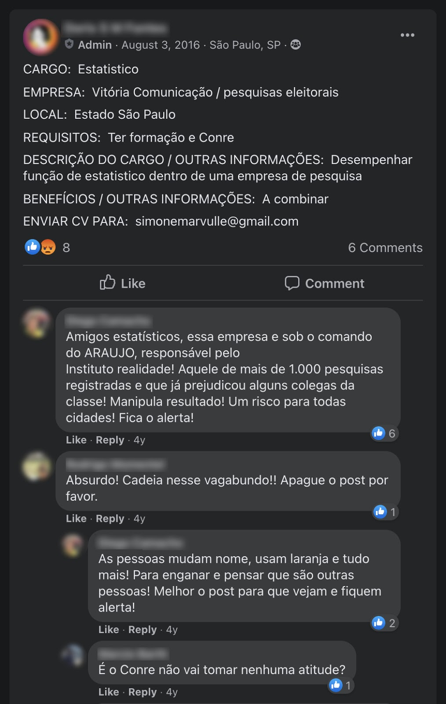

```{r setup, include=FALSE}
library(dplyr)
library(ggplot2)
library(stringr)

source('../theme.R')
load('realidade.Rdata')

knitr::opts_chunk$set(echo = FALSE)
knitr::opts_chunk$set(message = FALSE)
knitr::opts_chunk$set(warning = FALSE)

pn = function(x) format(round(x, 2), big.mark = '.', decimal.mark = ',', nsmall = 0, digits = 2)
```

```{r}
realidade = c('24776969000117', '07742623000189', '67662494000140', '14931054000185', '26195312000191')

ibope_polls = df_for_merge %>%
  filter(NR_CNPJ_EMPRESA == '68802370000186') %>%
  nrow()
 
datafolha_polls = df_for_merge %>%
  filter(NR_CNPJ_EMPRESA == '07630546000175') %>%
  nrow()


realidade_polls = df_for_merge %>%
  filter(NR_CNPJ_EMPRESA == '67662494000140') %>%
  nrow()

pp_polls = df_for_merge %>%
  filter(NR_CNPJ_EMPRESA %in% realidade) %>%
  nrow()

pp_cities = df_for_merge %>%
  filter(NR_CNPJ_EMPRESA %in% realidade) %>%
  filter(AA_ELEICAO != 2018) %>%
  distinct(SG_UE) %>%
  nrow()

pp_error = simple_rating %>%
  filter(company_id == 'REALIDADE') %>%
  pull(avg)
```


Durante as últimas décadas, um grupo de cinco institutos de pesquisa falsificou,
à custa do dinheiro público, cerca de cem pesquisas eleitorais por todo o
interior de São Paulo.

No esquema, prefeituras de cidades pequenas contratavam os institutos para a
prestação de serviços de consultoria. Mas em vez de cumprir esses contratos
com o Poder Público, as empresas produziam pesquisas falsas que previam
vitórias por amplas margens dos prefeitos envolvidos no arranjo.

A prática não é recente: os donos desses institutos acumulam condenações na
Justiça Eleitoral desde 1998, e devem mais de R\$ 500.000 ao governo em multas por
crimes eleitorais. No entanto, nada disso impediu que o esquema continuasse
prosperando: nas últimas quatro eleições, essas empresas responderam por mais de
um quarto das pesquisas eleitorais registradas em todo o estado de São Paulo.

Através de [dados do Tribunal Superior
Eleitoral](http://www.tse.jus.br/eleicoes/estatisticas/repositorio-de-dados-eleitorais-1/repositorio-de-dados-eleitorais)
e de processos em curso na Justiça, o _Pindograma_ analisou a atuação desses
institutos nos últimos anos. A seguir, mostramos os detalhes de como eles
falsificavam pesquisas -- e de como as instituições brasileiras falham ao punir
quem produz pesquisas eleitorais fraudulentas. Questionados pela reportagem, os
responsáveis pelo esquema não negaram as acusações.

##### Um por todos, todos por um

A segunda empresa que mais registrou pesquisas no Brasil entre 2012 e 2018 foi o
**Instituto Realidade**, sediado em Presidente Prudente (SP). Nesse período, o
Realidade declarou ter realizado `r pn(realidade_polls)` pesquisas, perdendo
somente para o Ibope, o maior instituto de pesquisas do país, que registrou
`r pn(ibope_polls)` sondagens. Já o Datafolha, outro instituto grande, registrou
somente `r pn(datafolha_polls)` pesquisas.

Apesar do grande número de pesquisas, contratar o Instituto Realidade não é uma
tarefa fácil. A empresa não tem site na internet ou perfil nas redes sociais,
tampouco cadastro no Google Maps ou em listas telefônicas. O telefone disponível
no Cadastro Nacional da Pessoa Jurídica (CNPJ) é dado como inexistente, e o
endereço de sua sede aponta para uma casa em um bairro residencial.

Só tivemos algum resultado quando pesquisamos pelos sócios do instituto, Otílio
Claudino de Araújo Júnior e Rose Mary Moreno de Araújo — casados até 2015. A
partir do número de celular disponível no [blog pessoal de
Rose](https://web.archive.org/web/20200124141501/http://www.rosemorenohoje.com.br/),
conseguimos conversar por alguns minutos com a empresa. A ligação, no entanto,
foi cortada três vezes, até que Rose informou que seu celular precisava
carregar, e pediu para que retornássemos em vinte minutos. A partir de então,
todas as ligações do _Pindograma_ passaram a cair na caixa postal.

<!--
Os números a seguir foram obtidos através de consultas processuais pelos
seguintes nomes das partes: "OTILIO CLAUDINO DE ARAUJO JUNIOR" e
"ROSE MARY MORENO DE ARAUJO".

Os crimes comuns foram todos os processos que apareceram na consulta pública
do Ministério Público do Estado de São Paulo. Já os eleitorais foram os que
apareceram na consulta pública do Ministério Público Federal, filtrados por
matéria eleitoral.
-->

Tivemos mais sorte procurando informações dos sócios nos arquivos do Judiciário.
Segundo o Ministério Público, Otílio já foi alvo de ao menos 29 investigações
por crimes comuns e 5 por crimes eleitorais; enquanto Rose foi objeto de ao
menos 4 investigações por crimes comuns e 5 por crimes eleitorais.

Os processos judiciais apontam que Otílio e Rose realizaram pesquisas
eleitorais -- tanto a partir do Instituto Realidade, quanto do **Instituto Full
Marketing e Pesquisas**, outra empresa da qual ambos são sócios. Além dessas
duas firmas, Rose Moreno também é proprietária de um terceiro instituto: a
**Consult Pesquisa**. Não bastasse, a atual esposa de Otílio, Simone Marvulle de
Araújo, é proprietária de um quarto instituto: a **Vitória Comunicação e
Assessoria Empresarial**.

Há também um quinto instituto que atuava, quase sempre, nas mesmas cidades que
Otílio e Rose: o **Instituto Quality**. Embora a sede da empresa seja em São
Paulo, o seu proprietário, Emerson Bezerra Oliveira, também é de Presidente
Prudente. Emerson, aliás, [consta como testemunha de
Rose](http://pindograma-dados.s3.amazonaws.com/reporting/Emerson%20Testemunha.pdf)
em um processo contra Otílio, logo após a separação do casal.

Somados, os cinco institutos registraram `r pn(pp_polls)` pesquisas entre 2012 e
2018, em `r pn(pp_cities)` cidades diferentes. O gráfico mostra como as
pesquisas foram distribuídas entre os cinco institutos nas eleições de 2012 e
2016:

```{r}
realidade_names = tibble(
  NR_CNPJ_EMPRESA = realidade,
  pretty_name = c('Vitória Comunicação', 'Full Marketing', 'Instituto Realidade', 'Consult Pesquisa', 'Quality Pesquisas')
)

realidade_df = df_for_merge %>%
  filter(NR_CNPJ_EMPRESA %in% realidade & AA_ELEICAO != 2018) %>%
  left_join(realidade_names) %>%
  mutate(AA_ELEICAO = factor(AA_ELEICAO)) %>%
  mutate(pretty_name = factor(pretty_name, levels = rev(c('Instituto Realidade', 'Full Marketing', 'Consult Pesquisa', 'Vitória Comunicação', 'Quality Pesquisas'))))

ggplot(realidade_df, aes(x = AA_ELEICAO, fill = factor(pretty_name))) +
  geom_bar(width = 0.4) +
  theme_pindograma() +
  scale_fill_manual(values = c(pg_blue, pg_yellow, pg_light_gray, pg_orange, pg_green)) +
  ylab('Pesquisas') + xlab('') +
  guides(fill = guide_legend(title="Instituto")) +
  labs(caption = 'Fonte: TSE')
```

##### Manipulando a massa

O controle de cinco empresas de pesquisa pelo grupo de Presidente Prudente não
era por acaso. Isso permitia que o grupo desse mais credibilidade aos seus
resultados -- afinal, é mais fácil confiar em muitos institutos do que em um só.

```{r}
# NOTA: A pesquisa incluía votos brancos e nulos; portanto, usamos resultados
# que também incluem votos brancos e nulos.

braga_rippa = pvotes %>%
  filter(SIGLA_UE == '69159' & ANO_ELEICAO == 2016) %>%
  mutate(frac = QTDE_VOTOS / sum(QTDE_VOTOS) * 100) %>%
  filter(NUMERO_CANDIDATO %in% c(45, 55)) %>%
  arrange(desc(frac))

braga_rippa_diff = braga_rippa$frac[1] - braga_rippa$frac[2]
```

Um caso que ilustra bem essa tática é o da cidade de Porto Ferreira (SP). A uma
semana da eleição de 2016, o grupo de Presidente Prudente realizou três
pesquisas na cidade, [todas apontando para a reeleição de Renata
Braga](https://web.archive.org/web/20200804065118/http://www.falaporto.com.br/politica/tres-pesquisas-apontam-reeleicao-de-renata-braga-nas-eleicoes-de-hoje)
por mais de 10 pontos percentuais. No entanto, Braga ficou em terceiro lugar --
`r pn(braga_rippa_diff)` pontos atrás do vencedor, Rômulo Rippa.

Outra vantagem de ter cinco empresas ficou clara nas eleições para a prefeitura
de Auriflama (SP), em 2012. Por conta de problemas metodológicos, as pesquisas
do Instituto Realidade foram impedidas de circular na cidade pela Justiça
Eleitoral. Contudo, a decisão não afetou significativamente o grupo, pois a
Consult Pesquisa [pôde continuar divulgando pesquisas
normalmente](http://pindograma-dados.s3.amazonaws.com/reporting/TRE-SP_RC_7208_6a5cd.pdf).

Os muitos institutos sob o controle de Otílio e Rose também ajudam o grupo a
renovar a sua reputação. Nas eleições de 2016 em Bady Bassitt (SP), [um jornal
da
região](https://web.archive.org/web/20160910141533/http://grupobomdia.com.br/pesquisas-apontam-eleicao-acirrada-em-bady-bassitt-tecnicamente-empatados/)
chamou atenção para o histórico duvidoso do Instituto Realidade. Mas a redação
pouco questionou a credibilidade da Vitória Comunicação ao divulgar as suas
pesquisas.

```{r}
coverage_ = df_for_merge %>%
  filter(NR_CNPJ_EMPRESA %in% realidade) %>%
  group_by(AA_ELEICAO, SG_UE) %>%
  summarize(number_of_companies = length(Reduce(intersect, list(NR_CNPJ_EMPRESA, realidade)))) %>%
  ungroup() %>%
  count(number_of_companies)

coverage = sum(coverage_$n[2:length(coverage_$n)])
```

A estratégia de registrar pesquisas com mais de uma empresa se repete em outros
municípios: das `r pn(sum(coverage_$n))` cidades onde o Otílio e Rose operavam,
`r pn(coverage)` tinham a presença de mais de uma empresa do grupo.

##### Pesquisas falsas

Duas semanas antes da eleição de Presidente Epitácio (SP) em 2012, o Instituto
Realidade divulgou pesquisa atribuindo liderança ao prefeito Mané da Brahma, com
37% dos votos, e indicou que o segundo colocado seria Picucha, com 32% -- o que
levaria a um segundo turno.


```{r}
# NOTA: A pesquisa incluía votos brancos e nulos; portanto, usamos resultados
# que também incluem votos brancos e nulos.

pepitacio = pvotes %>%
  filter(SIGLA_UE == '69272' & ANO_ELEICAO == 2012) %>%
  mutate(frac = QTDE_VOTOS / sum(QTDE_VOTOS) * 100)

picucha = pepitacio %>%
  filter(NUMERO_CANDIDATO == 40) %>%
  pull(frac)

mane = pepitacio %>%
  filter(NUMERO_CANDIDATO == 15) %>%
  pull(frac)
```

O resultado apontado pelas urnas, no entanto, foi bem diferente: Picucha ganhou
no primeiro turno, com `r pn(picucha)`% dos votos totais, enquanto Mané da
Brahma ficou em segundo, com `r pn(mane)`%.

Erros como esse são comuns para o grupo de Presidente Prudente. Entre as
pesquisas produzidas pelas empresas de Otílio e Rose a menos de três semanas das
eleições, o erro médio foi de `r pn(pp_error)` pontos percentuais -- um dos três
piores desempenhos entre todas as empresas incluídas no [Ranking de Institutos
de Pesquisa do _Pindograma_][2].

Ao que tudo indica, essa quantidade de erros se deve ao fato das empresas de
Rose e Otílio falsificarem sistematicamente os resultados de suas pesquisas. A
Justiça Eleitoral condenou a Consult Pesquisa por divulgar uma sondagem em
Auriflama [sem ter entrevistado nenhum
eleitor](http://pindograma-dados.s3.amazonaws.com/reporting/TRE-SP_RC_23789_9da36.pdf).
Já em Presidente Epitácio, o Instituto Realidade divulgou uma pesquisa que dava
3,8% das intenções de voto a Marco Aurélio, [sem que o nome do candidato
constasse no questionário da
pesquisa](http://pindograma-dados.s3.amazonaws.com/reporting/TRE-SP_RC_196_fb78c.pdf).

```{r}
number_same_cities_ = df_for_merge %>%
  filter(AA_ELEICAO == 2016 & NR_CNPJ_EMPRESA %in% realidade) %>%
  mutate(extra_norm_pa = str_replace_all(norm_pa, ',', '\\.') %>% word(2, sep = 'o plano amostral')) %>%
  group_by(extra_norm_pa) %>%
  summarize(cities = n_distinct(SG_UE), pesq = n()) %>%
  arrange(desc(cities))

number_same_cities = number_same_cities_$cities[1]
number_pesq = number_same_cities_$pesq[1]
```

Há fortes indícios de que essa prática se estendia a outros municípios do
estado. Em 2016, por exemplo, o grupo de Presidente Prudente declarou ter usado
o mesmo plano amostral, com leves alterações na margem de erro, para
`r pn(number_pesq)` pesquisas em `r pn(number_same_cities)` cidades diferentes.
Dado que nenhuma cidade brasileira tem uma população exatamente igual à de outra
-- quem dirá igual a de `r pn(number_same_cities)` outras -- fica claro que o
instituto tinha pouca preocupação metodológica em seus levantamentos.

```{r}
electors = pvotes %>%
  group_by(ANO_ELEICAO, SIGLA_UE) %>%
  summarize(eleitores = sum(QTDE_VOTOS))

monopoly = df_for_merge %>%
  group_by(AA_ELEICAO, SG_UE, NM_UE) %>%
  summarize(only_realidade = all(NR_CNPJ_EMPRESA %in% realidade)) %>%
  ungroup() %>%
  filter(only_realidade) %>%
  distinct(AA_ELEICAO, SG_UE, NM_UE) %>%
  left_join(electors, by = c('AA_ELEICAO' = 'ANO_ELEICAO', 'SG_UE' = 'SIGLA_UE'))

number_monopolies = nrow(monopoly)

number_voters = monopoly %>%
  distinct(SG_UE, .keep_all = T) %>%
  pull(eleitores) %>%
  sum()
```


O quadro de desinformação é grave por si só, mas fica pior ainda quando se
considera o contexto das cidades onde as pesquisas ocorreram. Entre 2012 e 2016,
os institutos ligados a Rose e Otílio não tiveram competição em
`r pn(number_monopolies)` pleitos municipais. Isto é, para `r pn(number_voters)`
eleitores distribuídos em cidades como Pindamonhangaba, Pirassununga e Monte
Alto, a única fonte de pesquisas eleitorais acerca do seu próximo prefeito ou
prefeita era de um grupo sem qualquer compromisso com a verdade.

##### O papel dos estatísticos

O Tribunal Superior Eleitoral, visando garantir o rigor metodológico das
pesquisas eleitorais, exige que toda sondagem eleitoral seja assinada por um
estatístico responsável. No entanto, essa exigência não impediu que o esquema de
Presidente Prudente prosperasse.

É comum que institutos pequenos não tenham dinheiro para pagar um estatístico
fora da temporada de eleição. Por isso, acabam contratando autônomos para fazer
os planos amostrais de suas pesquisas, em vez de empregarem um profissional com
dedicação exclusiva.

```{r}
augusto = df_for_merge %>%
  filter(est_id == 2) %>%
  nrow()

augusto_institutos = df_for_merge %>%
  filter(est_id == 2) %>%
  distinct(NR_CNPJ_EMPRESA) %>%
  nrow()

# Para o número de pesquisas de Márcia Cavallari Nunes, ver est_id = 303.

# Para Augusto e o Instituto Realidade, ver:
# df_for_merge %>% filter(NR_CNPJ_EMPRESA %in% realidade & AA_ELEICAO == 2016) %>% count(est_id)
```

Com o tempo, alguns desses profissionais se especializaram em pesquisas
eleitorais, e passaram a prestar serviços para vários clientes. É o caso de
Augusto da Silva Rocha, responsável por cerca de `r pn(augusto)` pesquisas nas
últimas quatro eleições. Número maior, até mesmo, do que o registrado pela
diretora do Ibope, Márcia Cavallari Nunes. Entre 2012 e 2018,
`r pn(augusto_institutos)` institutos declararam à Justiça Eleitoral pesquisas
assinadas por Augusto.

Foi também Augusto que assinou as pesquisas do grupo de Presidente Prudente em
2016. Segundo dados do TSE, ele foi responsável por todas as pesquisas
registradas por Otílio e Rose naquele ano.

Procurado pela reportagem, Augusto confirmou que fez cerca de cem planos
amostrais para os institutos Consult, Full Marketing e Realidade, com exceção do
Instituto Quality, o qual afirmou ter "fraudado todos os registros". Esse tipo
de falsificação da assinatura de estatísticos é comum e pouco fiscalizada pela
Justiça Eleitoral, conforme já [noticiou o Estado de S.
Paulo](https://politica.estadao.com.br/noticias/eleicoes,estatisticos-denunciam-fraudes-em-pesquisas,10000083473).

No entanto, chama a atenção que Augusto tenha aceito trabalhar para esses
institutos. Em 2016, o grupo de Presidente Prudente já acumulava condenações na
Justiça, e era conhecido entre alguns estatísticos:



Segundo o [Conselho Regional de Estatística da 3ª Região][3] (CONRE-3), todo
estatístico precisa ser cauteloso no mercado de pesquisas eleitorais, e lembrar
de sua responsabilidade técnica ao assinar pesquisas. No entanto, o volume de
trabalho de alguns estatísticos e a falta de fiscalização da Justiça Eleitoral
sobre as assinaturas dificulta que esses profissionais tomem todas as precauções
que o mercado exige. Com isso, esquemas como o de Otílio e Rose têm ampla
oportunidade para prosperar.

##### Quem paga a conta?

```{r}
realidade_value = df_for_merge %>%
  filter(NR_CNPJ_EMPRESA %in% realidade) %>%
  filter(VR_PESQUISA != 0) %>%
  pull(VR_PESQUISA) %>%
  mean()

realidade_self_hired_percent = df %>%
  filter(NR_CNPJ_EMPRESA %in% realidade) %>%
  mutate(self_hired = self_hired | grepl('mesma|Consult|Full Marketing|realidade', NM_CONTRATANTE)) %>%
  count(self_hired)

rshp = realidade_self_hired_percent$n[2] / sum(realidade_self_hired_percent) * 100
```


Segundo os valores declarados ao Tribunal Superior Eleitoral, cada pesquisa
municipal realizada pelo grupo de Presidente Prudente custa, em média, R\$
`r pn(realidade_value)`. Mas quem financia tantas pesquisas?

De acordo com as informações prestadas pelas próprias empresas ao TSE, ao longo
de quatro anos eleitorais, `r pn(rshp)`% dessas pesquisas foram contratadas e
pagas pelo próprio grupo.

É possível que uma empresa faça pesquisas com financiamento próprio -- sobretudo
como uma forma de conseguir visibilidade. Mas nenhum instituto consegue se
sustentar por quatro anos sem vender pesquisas. Segundo estatísticos ouvidos
pelo _Pindograma_, declarar uma sondagem como auto-contratada é quase sempre um
artifício para esconder quem realmente pagou por ela.

No caso do grupo de Presidente Prudente, realmente há o que esconder -- afinal,
o dinheiro para as pesquisas parece ter vindo dos cofres públicos. Além das
investigações por fraudes em pesquisas eleitorais, Rose e Otílio respondem a
vários processos de improbidade administrativa em cidades do interior de São
Paulo -- sempre as mesmas nas quais os institutos registraram as suas pesquisas
eleitorais.

Foi o que ocorreu nas eleições de 2012 em Iepê (SP). [Segundo o Ministério
Público](http://pindograma-dados.s3.amazonaws.com/reporting/doc_31248082.pdf) do
Estado de São Paulo, "as empresas requeridas realizavam pesquisas eleitorais
fraudulentas em que constavam inclusive resultados falsos visando beneficiar
determinado candidato; para ocultar o verdadeiro contratante (prefeito candidato
à reeleição), desses contratos constavam a própria empresa como contratante e
contratado. Como benefício, as empresas eram contempladas com diversos contratos
entabulados com o poder público [...] mediante fraude e direcionamento de
licitação com dispensas e inexigibilidade[s] ilegais de licitatórios".

Em outras palavras, o grupo de Presidente Prudente teria burlado mecanismos de
controle de gastos públicos de duas formas:

* Em Porto Ferreira, as empresas de Otílio e Rose [parecem ter formado um
cartel](http://pindograma-dados.s3.amazonaws.com/reporting/doc_50775746.pdf)
para ganhar uma licitação de R\$ 79.620. Entre os concorrentes no processo estavam
a Full Marketing e a Vitória Comunicação.

* Já em cidades como
[Arco-Íris](http://pindograma-dados.s3.amazonaws.com/reporting/doc_52345037.pdf)
(SP) e [Presidente
Prudente](http://pindograma-dados.s3.amazonaws.com/reporting/doc_48852720.pdf),
o grupo aparenta ter conseguido evitar licitações. Segundo o Ministério Público,
prefeituras envolvidas no esquema contratavam várias empresas do grupo para
realizarem serviços supostamente distintos. Individualmente, os valores dessas
contratações eram menores que R\$ 8.000, e dispensavam licitação. Mas somando
essas despesas, as empresas de Otílio e Rose teriam arrecadado milhares de reais
dos cofres públicos, sem dar à sociedade civil oportunidade de questionar os
gastos.

Além desses municípios, o Ministério Público Estadual denunciou o grupo por
práticas similares em
[Pirangi](http://pindograma-dados.s3.amazonaws.com/reporting/doc_31978925.pdf) e
[Buritama](http://pindograma-dados.s3.amazonaws.com/reporting/doc_59339318%20(1).pdf),
e iniciou investigações sobre as empresas em dezenas de outras cidades (embora
em quatro delas, o MP não tenha encontrado indícios suficientes para abrir uma
denúncia).

<!--
Dados sobre multas vêm da Dívida Ativa da União. Esse arquivo, em virtude de
seu tamanho, foi processado em https://deepnote.com/project/c0916474-2148-411b-afa5-576045b7dacf.
-->

Outros dados apontam, ainda, se tratar de um esquema muito anterior às últimas
eleições. Otílio acumula processos por crimes eleitorais [desde
1998](http://web.archive.org/web/20200817170759/http://inter03.tse.jus.br/sadpPush/ExibirDadosProcesso.do?nprot=162591998&comboTribunal=tse).
Em 2006, o Instituto Realidade foi condenado a pagar multa de R\$ 146.060,82 por
crimes eleitorais. E em 2009, um deputado federal do DEM [usou a cota
parlamentar](http://web.archive.org/web/20200817170639/https://brasil.io/dataset/gastos-deputados/cota_parlamentar/?search=INSTITUTO+DE+PESQUISAS+REALIDADE)
para fazer pagamentos à empresa.

**A Justiça é cega?**

Uma das maiores dificuldades para a investigação do esquema de Otílio e Rose é a
descentralização dos processos. Existem dois grupos que lidam com o tema:
promotores do Ministério Público Estadual para crimes de improbidade
administrativa, e procuradores do Ministério Público Eleitoral para falsificação
dos resultados de pesquisas. Além disso, todas essas investigações são feitas em
âmbito municipal -- ou seja, há dezenas de inquéritos que miram Otílio e Rose
correndo em paralelo, muitas vezes sem diálogo entre si. Não é fácil, portanto,
conseguir condenações do grupo de Presidente Prudente na Justiça.

No entanto, mesmo quando Otílio e Rose são condenados de fato, o casal permanece
impune. Não existe um equivalente à Lei da Ficha Limpa para as empresas de
pesquisa: ou seja, empresas condenadas por fraude a pesquisas eleitorais não
encontram obstáculos para a publicação de novas sondagens.

É o que aconteceu com o grupo de Presidente Prudente. Em 2012, o Ministério
Público Eleitoral denunciou o Consult Pesquisa e sua proprietária, Rose Moreno,
por terem publicado uma pesquisa eleitoral fraudulenta em Auriflama (SP). Houve
condenação, que foi [confirmada pela segunda instância][4] em março de 2016.
Mesmo assim, Rose veio a realizar centenas de pesquisas eleitorais naquele ano
-- seja através de outras empresas do grupo, seja através do próprio Consult
Pesquisa.

<!--
Dados sobre multas vêm da Dívida Ativa da União. Esse arquivo, em virtude de
seu tamanho, foi processado em https://deepnote.com/project/c0916474-2148-411b-afa5-576045b7dacf.
-->

Além disso, a pena para fraude em pesquisa eleitoral é pequena. Há a detenção
entre seis meses e um ano -- imposta quase sempre em regime aberto -- e uma
multa de R\$ 177 mil a R\$ 355 mil. Mas mesmo a multa não surte efeitos
práticos. O Instituto Realidade, por exemplo, deve R\$ 376,4 mil à União em
razão de multas eleitorais não quitadas. Já Otílio acumula pessoalmente uma
dívida de R\$ 101,57 mil, enquanto Rose contabiliza R$ 94,19 mil em multas. Nada
indica que o grupo de Presidente Prudente pretenda quitar essas dívidas -- ou
que alguma multa já tenha desencorajado o esquema de Otílio e Rose.

O caso desses institutos escancara como as instituições brasileiras permitem que
fraudes em pesquisas eleitorais ocorram de maneira sistemática por décadas, sem
que consequências mais severas aconteçam. E é improvável que o grupo de
Presidente Prudente seja o único. Há dezenas de outros institutos que chamam a
atenção – seja por uma ausência de pesquisas efetivamente publicadas, por um
elevado índice de erro, ou por seus proprietários possuírem outras empresas do
ramo.

**O que dizem os citados**

A reportagem entrou em contato com Rose Moreno, Simone Marvulle e Emerson
Bezerra Oliveira, contudo não obteve resposta.

Já Otílio Araújo pediu que a reportagem fizesse "uma correção em Presidente
Epitácio", mas depois disse não ter "nada a comentar ou acrescentar". Ao ler a
íntegra da reportagem, completou: "Tem como eu patrocinar uma divulgação maior e
mais abrangente? Gostaria que atingisse os estados do Nordeste e Mato Grosso do
Norte também. Gostei do título, agradecemos a gentileza".

_A empresa Consult Pesquisa citada na reportagem não tem relação com a empresa
Consult Pesquisa sediada no Rio Grande do Norte._

---

**Contribuíram com a reportagem**: Daniel Ferreira e Antonio Piltcher.

**Dados usados na matéria**: Registro de Pesquisas Eleitorais (Tribunal Superior
Eleitoral); Dívida Ativa da União (Procuradoria-Geral da Fazenda Nacional);
Consulta Processual (Ministério Público do Estado de São Paulo, Ministério
Público Federal, Tribunal de Justiça do Estado de São Paulo, Jusbrasil);
Ranking de Pesquisas Eleitorais (_Pindograma_).

Para reproduzir os números citados, o código pode ser consultado [aqui][1].

[1]: https://github.com/pindograma/materias/blob/master/2020-06-07-pesquisas-falsas/Realidade.Rmd

[2]: /ranking.html

[3]: https://web.archive.org/web/20200221110544/http://www.conre3.org.br/portal/fraudes-eleitorais/

[4]: http://pindograma-dados.s3.amazonaws.com/reporting/TRE-SP_RC_23789_9da36.pdf
