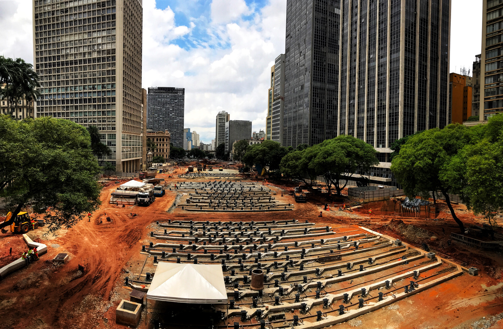

```{r setup, include=FALSE}
library(gt)
library(dplyr)

source('../theme.R')
load('reel.Rdata')

knitr::opts_chunk$set(echo = FALSE)
knitr::opts_chunk$set(message = FALSE)
knitr::opts_chunk$set(warning = FALSE)

pn = function(x) format(round(x, 2), big.mark = '.', decimal.mark = ',', nsmall = 0, digits = 2)
```

```{r}
has_reel = bind_rows(reel_04, reel_08, reel_12, reel_16) %>%
  filter(has_reel) %>%
  nrow()

success = reel_successes = bind_rows(reel_04, reel_08, reel_12, reel_16) %>%
  filter(success) %>%
  nrow() / has_reel * 100
```

Desde as eleições de 2004, em média `r pn(reel_successes)`% dos prefeitos que
concorreram à reeleição tiveram sucesso. Este ano, [61% dos
prefeitos](https://agenciabrasil.ebc.com.br/politica/noticia/2020-10/eleicoes-2020-mais-da-metade-dos-prefeitos-tentarao-reeleicao)
apostam em suas chances para conquistar um segundo mandato seguido. Alguns até
impressionam pela [quantidade de
vezes](https://pindograma.com.br/2020/10/26/prefeitos-longevos.html) que já
exerceram o cargo.

Com tantos incumbentes tentando manter seus cargos, surgem algumas perguntas:
Quais são os principais fatores que determinam as chances de uma reeleição? A
possibilidade de reeleição influencia o comportamento dos prefeitos,
motivando-os a tomar medidas eleitoreiras? Quão importante é o nome ou a
família do candidato? Vale a pena ser uma boa prefeita para se reeleger?
Políticos alinhados ao presidente têm mais chances? E aqueles alinhados à
governadora?

Há uma modesta, porém crescente literatura sobre o assunto, que traz algumas
respostas:

* Na maioria das circunstâncias, estar concorrendo a uma reeleição é uma
  desvantagem eleitoral.

* Eleitores tendem a recompensar uma boa gestão com mais votos e punir gestões
  ruins votando em outros candidatos.

* O alinhamento ao presidente ou ao governador do estado não parece influenciar
  muito as chances de reeleição.

* Investimentos na infraestrutura municipal geram mais recompensas para o
  prefeito do que gastos sociais, como saúde e educação.

* O acesso à informação sobre a qualidade de serviços públicos afeta o
  comportamento dos votantes, embora os efeitos variem de acordo com a renda e
  a escolaridade.

A seguir, explicamos mais a fundo cada um desses efeitos sobre a probabilidade
de reeleição.

##### Incumbência

Um prefeito incumbente é aquele que ocupa o cargo — neste contexto, aquele que
está terminando seu mandato e concorre à reeleição. Para alguns observadores, a
condição de "estar no poder" aumentaria a chance de eleição de um candidato,
porque a incumbência lhe daria mais visibilidade e maior influência sobre cabos
eleitorais. No entanto, dois estudos recentes mostram que prefeitos incumbentes
tiveram, excluindo outros fatores, uma desvantagem eleitoral quando concorreram
à reeleição:

```{r}
tibble(
  Ano = c(2000, 2004, 2008, 2012, 2016),
  `Brambor e Ceneviva (2011)` = c(-9.4, -4.3, 2, NA, NA),
  `Araújo Jr. e Pires (2020)` = c(NA, -9.3, 0.48, -1.32, -4.88)
) %>%
  gt(rowname_col = 'Ano') %>%
  tab_header(title = 'Efeito Médio da Incumbência sobre o Percentual de Votos de Candidatos a Prefeito (2000-2016)',
             subtitle = '(segundo dois estudos)') %>%
  tab_source_note('Thomas Brambor e Ricardo Ceneviva, "Incumbency Advantage in Brazilian Mayoral Elections" (2011); Ari Francisco de Araújo Júnior e Tiago Silva Pires, "A vantagem do incumbente nas eleições municipais e estaduais brasileiras: um estudo de 2000 a 2018" (2020).') %>%
  theme_pindograma_table() %>%
  theme_pindograma_table_stub()
```

Para os pesquisadores, até é possível que as condições econômicas do país
possam transformar a incumbência em um fator vantajoso. Afinal, candidatos
incumbentes tiveram um desempenho melhor em 2008, quando, [segundo os
pesquisadores](https://papers.ssrn.com/sol3/papers.cfm?abstract_id=1903410)
Thomas Brambor e Ricardo Ceneviva, o país passava por "um ânimo forte e
crescimento econômico extraordinário durante o governo Lula". Ainda assim, a
incumbência continua sendo, na maioria dos casos, uma desvantagem para quem
busca a reeleição.

Isso pode parecer contraintuitivo: se a incumbência é uma desvantagem
eleitoral, como a maioria dos prefeitos consegue se reeleger? Segundo os
pesquisadores, isso ocorre porque o efeito negativo da incumbência é compensado
pelo efeito positivo de outros fatores. Por exemplo, um prefeito pode ter sido
eleito pela primeira vez porque apresentava a imagem de um gestor competente, e
pode ter sido reeleito pelo mesmo motivo. Esse motivo pouco tem a ver com
"estar no poder", e compensa o efeito negativo da incumbência. 

##### Gestão Fiscal

Para além da incumbência, alguns comportamentos e condições influenciam
consideravelmente as chances de reeleição. Um desses comportamentos é o chamado
“comportamento eleitoreiro”, que consiste em aumentar os gastos da prefeitura
em ano de eleição.

O economista Jonatan Lautenschlage, da Universidade Federal de Santa Catarina,
[explorou](https://periodicos.ufsc.br/index.php/economia/article/view/2175-8085.2019v22n1p113)
como o comportamento eleitoreiro afetou as chances de reeleição de prefeitos.
Ele analisou os resultados eleitorais em Santa Catarina de 2005 a 2016 e
concluiu que, pelo menos naquele estado, os prefeitos que aumentaram as
despesas da prefeitura durante anos de eleição obtinham aumentos consideráveis
nas suas probabilidades de reeleição. Essa situação [já era conhecida há alguns
anos](https://www.scielo.br/scielo.php?script=sci_arttext&pid=S0034-71402010000100001)
pela ciência política, e continuou ocorrendo nesta década.



Já Pedro Cavalcante, pesquisador da Escola Nacional de Administração Pública,
estudou outros efeitos da gestão fiscal sobre a reeleição. Em um
[artigo](https://www.scielo.br/scielo.php?script=sci_arttext&pid=S0034-76122016000200307&lng=pt&tlng=pt)
publicado em 2016, Cavalcante mostrou que, entre 2000 e 2012, a quantidade de
investimentos em obras e na infraestrutura municipal foi um fator muito mais
influente para as chances de reeleição que os gastos sociais, como despesas em
assistência social ou no pagamento de professores e médicos.

Cavalcante não assume que o eleitor decida como votar olhando para o orçamento
da prefeitura. Em vez disso, ele especula que as pessoas consigam perceber como
uma boa gestão se reflete no dia a dia. Isto pode ser uma das razões de
investimentos terem tanto impacto na votação, já que têm resultados de curto
prazo e são facilmente perceptíveis para moradores dos municípios. É muito mais
fácil para um eleitor identificar a construção de uma nova escola na cidade do
que algo como um aumento nos salários dos médicos. 

##### Políticas Públicas e Acesso à Informação

No entanto, o eleitor é capaz de identificar melhor os efeitos de gastos
sociais quando há o acesso a indicadores sobre a qualidade dos serviços
providos pela prefeitura. Em um
[estudo](http://www.econ.puc-rio.br/uploads/adm/trabalhos/files/TD668.pdf)
publicado em 2019, os economistas Cláudio Ferraz e Marina Dias observaram a
divulgação do IDEB (um índice que mede a [qualidade da
educação](https://pindograma.com.br/2020/10/09/indicadores-edu.html) em um
município, de 0 a 10) e como ela mudou as chances de reeleição de prefeitos por
todo o Brasil.

Ferraz e Dias concluíram que nos arredores de escolas com as notas 20% mais
altas do IDEB, houve um aumento entre 1,3 e 2,6 pontos percentuais nos votos em
prefeitos incumbentes. Já nos arredores das escolas com as notas 20% mais
baixas, prefeitos incumbentes perdem em média 1,33 pontos percentuais dos
votos.

Os pesquisadores Sergio Firpo, Renan Pieri e André Portela Souza, do Insper e
da FGV, concluíram algo parecido [em outro
estudo](https://www.sciencedirect.com/science/article/pii/S1517758016300686)
publicado em 2017: em média, um aumento de 1 ponto no IDEB durante a gestão de
um prefeito resultou em um aumento de 5 pontos percentuais nas chances de
reeleição na eleição seguinte. Os autores também mostraram que antes do IDEB
ser divulgado, os eleitores eram pouco suscetíveis a mudanças na qualidade das
escolas municipais, indicando a importância do acesso à informação para a
decisão de quem vota.

Os dois estudos discordam em um ponto: enquanto Ferraz e Dias colocam mais
enfoque em como eleitores reagem à nota no IDEB no ano da eleição, Firpo e seus
colegas analisam como mudanças nos indicadores durante o mandato afetam a
votação. Segundo Ferraz, os eleitores tendem a votar contra um candidato
incumbente em caso de uma nota baixa no IDEB, mesmo que o índice tivesse
melhorado durante o mandato. Já para Firpo e seus colegas, os eleitores tendem
a recompensar um prefeito incumbente que melhorou a nota do município no IDEB.

Porém, os eleitores não reagiram de modo homogêneo à informação sobre o
desempenho das escolas. Segundo Ferraz e Dias, votantes com mais escolaridade
foram mais afetados pela informação do IDEB do que aqueles com menos anos de
escola.


Uma outra área analisada por estudos é a saúde, que parece exercer algum
impacto sobre os eleitores, a despeito da ausência de índices de desempenho
amplamente divulgados. Nesse sentido, os pesquisadores da Universidade Federal
do Ceará Pablo Castelar, Vitor Monteiro e Paulo de Melo
[usaram](http://www.seer.ufu.br/index.php/revistaeconomiaensaios/article/view/41651)
a quantidade de atendimentos ambulatoriais per capita como um indicador da
qualidade da saúde no município. Com base nisso, concluíram que os eleitores
recompensaram os incumbentes nos municípios nos quais a qualidade dos serviços
de saúde era melhor. 

Assim como no caso do IDEB, o efeito de um bom sistema de saúde também difere
de acordo com as características do eleitorado: nesse caso, a renda da cidade.
Em municípios com renda per capita acima de R\$ 3.170, os impactos de melhorias
na saúde influenciam menos as eleições do que em cidades com renda per capita
abaixo dessa quantia. O estudo teoriza que isso pode ocorrer porque cidades de
renda mais baixa teriam mais pessoas que dependem da saúde pública, e que por
isso seriam mais impactadas por mudanças nesse setor.

**Filiação Partidária**

À primeira vista, a filiação partidária de uma prefeita parece ser importante
para suas chances de reeleição, especialmente se ela for do mesmo partido que o
presidente ou o governador de seu estado. A União e o governo do estado são
responsáveis por repasses de verbas que podem impactar profundamente a gestão
da prefeitura e, teoricamente, estariam mais dispostos a fazer repasses para
seus aliados políticos.

Foi o que mostrou o pesquisador Pedro Cavalcante. Em seu estudo de 2016, ele
observou que ter a mesma filiação partidária do governador resultava em um
aumento entre 10% e 16% nas chances de reeleição de um prefeito incumbente.

Os pesquisadores Felipe Silva e Marcelo Braga, da Universidade Federal de
Viçosa, [encontraram resultados
parecidos](https://www.ipea.gov.br/ppp/index.php/PPP/article/view/375) nas
eleições municipais baianas de 2004 e 2008. Eles estimaram que, no estado, o
aumento na probabilidade de reeleição era de 15% se houvesse aliança com o
governador.

Mas ao analisar as eleições de Santa Catarina entre 2005 e 2016, o pesquisador
Jonatan Lautenschlage não encontrou esse efeito. Ele concluiu que o alinhamento
com o governador não mudava as chances de reeleição. Foi a mesma conclusão de
Pablo Castelar e seus colegas da Universidade Federal do Ceará ao analisarem as
eleições de 2008 por todo o país. 

Em resumo, alguns estudos mostram a importância do apoio do governador do
estado à prefeita incumbente, enquanto outros põem em questão sua
significância. O que parece ser consenso é que fazer parte do partido do
presidente tem pouco impacto sobre a chance de reeleição dos prefeitos. Essa
condição se aplica tanto ao PT e o apoio do presidente Lula quanto a 2020, ano
em que o apoio do presidente Bolsonaro [não tem
ajudado](https://www1.folha.uol.com.br/colunas/bruno-boghossian/2020/11/bolsonaro-tem-peso-nulo-ou-negativo-nas-eleicoes-municipais-ate-aqui.shtml)
muito seus aliados.


A reeleição de prefeitos incumbentes foi estudada a partir de diferentes
perspectivas e é evidente que ela não facilita, necessariamente, a permanência
de políticos no poder: não é fácil se reeleger prefeito no Brasil.

Também sabemos que alguns fatores afetam as chances de reeleição mais do que
outros. Investimentos são mais recompensados pelo eleitor que gastos sociais,
mesmo que estes possam vir a ser mais influentes caso haja publicidade sobre os
seus efeitos, como no caso do IDEB.

Além disso, a filiação partidária não parece importar tanto nas eleições
municipais, por mais que alguns estudos indiquem que o alinhamento com o
governador do estado possa ser importante. 

Todos os fatores mencionados por esses estudos provavelmente impactarão as
chances de prefeitos e prefeitas concorrendo à reeleição em 2020, mas há
questões que só terão respostas depois desse pleito. Será, por exemplo, que
eleitores recompensarão os políticos que tiveram planos mais rigorosos contra a
transmissão do coronavírus? Ou irão punir aqueles que impuseram _lockdowns_
mais severos e impediram a economia de se reabrir?

---

**Dados usados na matéria**: Resultados de Eleições (Tribunal Superior
Eleitoral/Cepespdata).

**Contribuiu com dados**: Daniel Ferreira.

**Créditos da imagem**: Patrícia Cruz/TSE.

Para reproduzir os números da matéria, o código pode ser encontrado [aqui][1].

[1]: https://github.com/pindograma/materias/blob/master/2020-11-12-reeleicoes/Reeleicoes.Rmd
