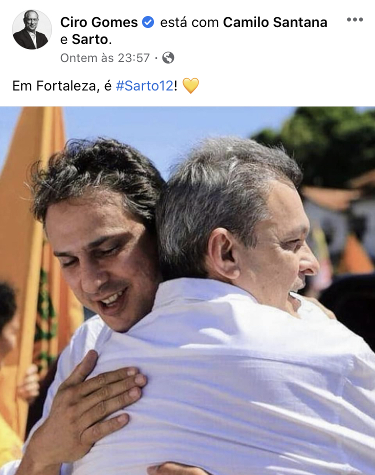

```{r setup, include=FALSE}
library(dplyr)
library(sf)
library(ggplot2)

source('../theme.R')
load('fortaleza.Rdata')

knitr::opts_chunk$set(echo = FALSE)
knitr::opts_chunk$set(message = FALSE)
knitr::opts_chunk$set(warning = FALSE)

pn = function(x) format(round(x, 2), big.mark = '.', decimal.mark = ',', nsmall = 0, digits = 2)
```

Após um primeiro turno contestado, José Sarto (PDT) foi o mais votado e agora
enfrentará Capitão Wagner (PROS) no segundo turno pela prefeitura de Fortaleza.
Os dois candidatos representam duas visões diferentes sobre os problemas
locais, assim como antagonismos no âmbito da política nacional. Com base nos
mapas gerados abaixo, analisamos as votações no primeiro turno e as bases
eleitorais destes candidatos no passado para entender melhor a eleição deste
domingo.

Com 35,72% dos votos, **Sarto** obteve uma votação espalhada uniformemente por
toda Fortaleza, com alguma concentração nos bairros de classe média e baixa no
entorno do aeroporto. O pedetista falhou, porém, ao angariar o apoio das
periferias no Oeste da cidade.

```{r}
ggplot() +
  ggtitle('José Sarto (PDT)') +
  geom_sf(data = fortaleza_all %>% mutate(cand_12 = ifelse(cand_12 >= .4, .4, cand_12)), aes(fill = cand_12), lwd = 0) +
  scale_fill_distiller(palette = "YlOrRd", direction = 1, labels = scales::percent_format(accuracy = 1)) +
  annotate('curve', curvature = -.15,
          x = -38.45, xend = -38.51,
          y = -3.725, yend = -3.775,
          arrow = arrow(angle = 20, length = unit(.2, "cm")), size = .5,
          color = "grey30") +
  annotate('text', label = 'Região do\nAeroporto',
            color = "grey10",
            x = -38.423, y = -3.725, size = 3.5, family = 'Fantasque') +
  theme_void() +
  theme(text = element_text(family = 'Fantasque')) +
  labs(caption = "Fonte: Base de locais de votação do Pindograma, TSE") +
  theme(plot.title = element_text(size = 16,
                                  color = pg_dark_gray,
                                  hjust = 0.5,
                                  margin = margin(5, 0, 15, 0),
                                  face = 'bold')) +
  theme(plot.caption.position = 'plot') +
  theme(plot.caption = element_text(hjust = 0, size = 12, color = pg_dark_gray)) +
  theme(legend.title = element_blank(),
        legend.position = "bottom")
```

José Sarto busca reconstruir a coalizão que elegeu seu antecessor, Roberto
Cláudio (PDT), em 2016. Naquele ano, o voto pedetista foi concentrado
principalmente no centro e nos bairros ricos de Fortaleza. Mas em 2020, Sarto
não conseguiu repetir um apoio de tamanha escala nessas regiões.

A 2 dias da eleição, Sarto segue favorito e
[pesquisas](https://pindograma.shinyapps.io/agregador/) indicam sua vitória.
Além da vantagem de Sarto no primeiro turno, a terceira colocada, Luizianne
Lins ([PT](https://pindograma.com.br/2020/10/27/pt.html)), também declarou
apoio ao pedetista. 

Já o rival de Sarto, **Capitão Wagner**, teve apoio concentrado no Centro
e nos bairros ricos de Fortaleza. Essas regiões, como a praia de Iracema e o
bairro Meireles, haviam votado no PDT de Roberto Cláudio em eleições
anteriores. Wagner também tem força em uma região onde o PT e o PDT haviam sido
fracos historicamente: os bairros periféricos no Oeste da cidade.

```{r}
ggplot() +
  ggtitle('Capitão Wagner (PROS)') +
  geom_sf(data = fortaleza_all %>% mutate(cand_90 = ifelse(cand_90 >= .4, .4, cand_90)), aes(fill = cand_90), lwd = 0) +
  scale_fill_distiller(palette = "Blues", direction = 1, labels = scales::percent_format(accuracy = 1)) +
  annotate('curve', curvature = -.15,
            x = -38.495, xend = -38.495,
            y = -3.7, yend = -3.723,
            arrow = arrow(angle = 20, length = unit(.2, "cm")), size = .5,
            color = "grey30") +
  annotate('text', label = 'Meireles',
            color = "grey10",
            x = -38.495, y = -3.695, size = 3.5, family = 'Fantasque') +
  theme_void() +
  theme(text = element_text(family = 'Fantasque')) +
  labs(caption = "Fonte: Base de locais de votação do Pindograma, TSE")+
  theme(plot.title = element_text(size = 16,
                                  color = pg_dark_gray,
                                  hjust = 0.5,
                                  margin = margin(5, 0, 15, 0),
                                  face = 'bold')) +
  theme(plot.caption.position = 'plot') +
  theme(plot.caption = element_text(hjust = 0, size = 12, color = pg_dark_gray)) +
  theme(legend.title = element_blank(),
        legend.position = "bottom")
```

**Os candidatos**

Para chegar ao segundo turno, Sarto batalhou com Luizianne Lins para parecer
mais próximo de Camilo Santana (PT), o atual governador do Ceará, que é
extremamente
[popular](https://www.opovo.com.br/noticias/politica/2020/10/20/vice-de-luizianne-pede-que-pdt-use-imagem-de-ciro-na-campanha-de-sarto.html)
em Fortaleza. Santana se manteve neutro na disputa, para não contrariar o PT
nem os irmãos Ferreira Gomes. Já no segundo turno, Sarto conseguiu o apoio do
governador. O candidato defende a continuidade do projeto de poder de esquerda
encabeçado por seu partido na cidade.



Em sua campanha, Sarto apela para o lado positivo de gestões anteriores. Em uma
[entrevista](https://www.youtube.com/watch?v=0FQ71mRJkNw) recente, o candidato
parabenizou a gestão atual pelo controle da pandemia, citando a redução do
número de casos de coronavírus. Citou também os [105
mil](https://drive.google.com/file/d/1njmfnO12ajeCfZNTAo0UtZXfTKxulh2I/view)
alunos matriculados em tempo integral, prometendo seguir com o trabalho bem
avaliado na área da educação.

Enquanto isso, Wagner tem buscado se descolar de Bolsonaro, que apoia sua
candidatura, já que a
[rejeição](https://www.focus.jor.br/aprovacao-de-bolsonaro-em-fortaleza-e-a-quarta-pior-do-pais-mostram-pesquisas-ibope/)
do presidente é alta na capital cearense. O nome de Bolsonaro [não
aparece](https://twitter.com/capitao_wagner/status/1313490569973452806) nas
redes sociais ou nos programas eleitorais do candidato.

Outra parte do esforço de Wagner para diminuir sua imagem de extremista de
direita é a tentativa de se distanciar dos motins de policiais militares em
Fortaleza. Ex-capitão da PM, Wagner
[liderou](http://g1.globo.com/ceara/noticia/2012/01/lider-da-greve-da-pm-no-ceara-diz-que-quer-se-candidatar-prefeito.html)
o motim de 2011 e ganhou projeção estadual com a paralisação. Em março deste
ano, houve outro motim da PM no estado, e Wagner [apresentou um
projeto](https://mais.opovo.com.br/colunistas/carlosmazza/2020/03/04/capitao-wagner-apresenta-lei-para-anistiar-pms-do-ceara--maia-rejeita-tese.html)
à Câmara dos Deputados para anistiar os policiais amotinados.

Em
[entrevista](https://www.redebrasilatual.com.br/politica/2020/10/eleicoes-fortaleza-2020-lula-bolsonaro/)
à Rede Brasil Atual, a professora de Teoria Política da Universidade Estadual
do Ceará Monalisa Torres afirmou que "diferentemente de 2012, dessa vez o motim
foi muito desgastante para as lideranças que participaram, porque foi muito
mais violento. Então ele tenta se desvincular desse evento." No meio do caos, o
ex-governador do Ceará Cid Gomes [foi
baleado](https://noticias.uol.com.br/politica/ultimas-noticias/2020/02/19/senador-cid-gomes-e-baleado-no-ceara.htm)
quando usava uma retroescavadeira para tentar acabar com um motim em 2020.

Wagner não fica, porém, só na defensiva. Troca farpas com seu adversário e
ataca Sarto por ser o candidato da situação. Em uma
[mensagem](https://twitter.com/capitao_wagner/status/1325261382586163200) de
campanha, o candidato do PROS se dirige a Sarto como "o candidato dos Ferreira
Gomes" e faz críticas ao controle do grupo sobre a política local e
[aponta](https://twitter.com/capitao_wagner/status/1318689555755782152) também
para o fato de o Ceará ser um dos estados mais violentos do país. 

Com o triunfo de Sarto contra Luizianne no primeiro turno, o PDT demonstrou a
sua hegemonia sobre o voto da esquerda em Fortaleza. Enquanto isso, seguindo o
padrão de outros candidatos da direita, Capitão Wagner pena para mostrar que é
mais do que o candidato do bolsonarismo.

---

**Dados utilizados na matéria**: Locais de Votação (_Pindograma_); Votação por
Seção Eleitoral (Tribunal Superior Eleitoral).

**Contribuiu com dados**: Daniel Ferreira.

**Créditos da imagem**: Otávio Nogueira/Wikimedia Commons, Daniel
Aderaldo/Câmara dos Deputados.

Para reproduzir os números citados, o código e os dados podem ser encontrados
[aqui][1].

[1]: https://github.com/pindograma/materias/blob/master/2020-11-28-fortaleza/fortaleza.Rmd
