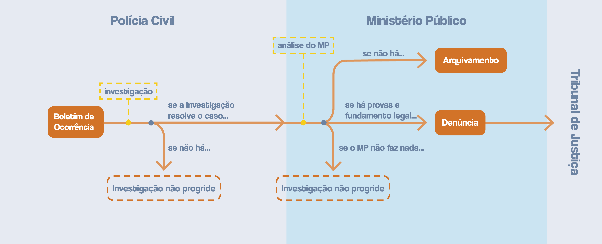

_Esta matéria é a primeira parte de uma série sobre dados do sistema de justiça
criminal no Rio de Janeiro. Se você quiser ler a segunda parte, sobre alguns
defeitos da atuação do Ministério Público do Rio, leia [aqui][1]. Se você quiser ler
a entrevista com a coordenadora do projeto que disponibilizou os dados, leia
[aqui][2]._

O Brasil passou por um aumento vertiginoso de violência na última década, e
parte do problema vem da ineficiência dos órgãos do Estado que deveriam
proteger os cidadãos. A polícia brasileira, por exemplo, é [a mais violenta do
mundo](https://piaui.folha.uol.com.br/policia-que-mais-mata/), embora mostre
poucos resultados no combate ao crime. Ao mesmo tempo, não se abre processo na
Justiça esperando uma resolução rápida.

Aqui, o _Pindograma_ explica pra você como funciona, na teoria e na prática, o
sistema de justiça criminal no Rio de Janeiro -- e quem são os responsáveis
pelo seu mau desempenho. Dos casos de homicídio registrados em 2015 no estado,
**apenas 3,5% foram julgados** até o final de 2019.

##### O passo a passo da justiça criminal

O Brasil não possui um sistema de justiça criminal unificado a nível nacional.
Com exceção de certos crimes que demandam investigações federais, como lavagem
de dinheiro, os órgãos que lidam com esse tema são **estaduais**.

Quando um crime acontece, o Estado lida com ele em três etapas. A primeira é o
**Registro de Ocorrência (o B.O.)**, protocolado na Polícia Civil. Esta polícia
então coleta provas, recolhe depoimentos de testemunhas e analisa a cena do
crime. Essas informações são compiladas em um **Inquérito Policial**, que é
então repassado a uma das promotorias do **Ministério Público** (MP).

Há, porém, muitos casos que não são resolvidos pela polícia. Esses inquéritos
inconclusivos são devolvidos à Polícia pelo Ministério Público para que a
investigação seja aprofundada.

Quando a polícia resolve o crime, a segunda etapa é a **análise do Inquérito
Policial pelo Ministério Público**. Após essa análise, o inquérito pode seguir
dois caminhos: a denúncia ou o arquivamento. A **denúncia** ocorre quando os
promotores julgam que há provas suficientes contra o investigado e que a
conduta do investigado se encaixa em algum crime previsto na legislação. A
denúncia é mandada, então, aos tribunais. A outra opção de finalização do
inquérito é o **arquivamento**, que ocorre quando a promotora responsável
acredita não haver provas suficientes contra o investigado.

Se o inquérito virar uma denúncia, a terceira etapa é a sua **tramitação dentro
do Tribunal de Justiça**. Quando isso acontece, o procedimento depende do
crime.

Nos tribunais, a promotoria faz a acusação do réu baseada nas provas coletadas
pela Polícia Civil e o pelo próprio MP, enquanto um advogado — ou a
**Defensoria Pública**, caso o réu não tenha condições de pagar por sua defesa
— tem o papel de defender o réu.

* Na maioria dos crimes, cabe ao juiz decidir se o investigado é culpado ou
  inocente. Posteriormente, a decisão do juiz (a **sentença**) pode ser revista
  por um juiz de uma instância superior, o _desembargador_.

* Já os homicídios e outros crimes intencionais contra a vida são julgados
  por um **júri**. Por isso, demandam uma tramitação em dois passos: a
  Pronúncia e a Sentença.

  Primeiro, o juiz avalia se há elementos suficientes para a denúncia ser
  julgada. Se o juiz acreditar que sim, há a chamada **sentença de pronúncia**,
  e a denúncia segue para o Tribunal do Júri. Se não houver a sentença de
  pronúncia, o processo não prossegue.

  Depois, no julgamento, o júri deve decidir sobre a culpa do acusado. Com base
  na decisão do júri, o juiz calcula a pena e lê a **sentença**.

  Independente da sentença, seja ela de culpa ou de absolvição, tanto acusação
  quanto a defesa podem recorrer à instância superior para questionar o
  veredito do júri. Se o juiz da instância superior achar que o júri tenha
  ignorado provas em sua decisão, ele pode pedir que o processo seja julgado de
  novo com outro júri. Procuradores e advogados também podem questionar o
  cálculo de pena do juiz de primeira instância. 

##### O mau desempenho do sistema de justiça criminal

Na prática, é raro que uma ocorrência percorra todos esses passos até chegar no
julgamento. Uma janela para esses problemas é o [Projeto Farol][3], desenvolvido
pelo Centro de Pesquisa do Ministério Público do Rio de Janeiro (CENPE/MPRJ). O
projeto compilou, pela primeira vez, dados básicos sobre o sistema criminal no
Rio de Janeiro e passou a permitir um mapeamento inédito de quão bem — ou mal —
cada peça do sistema funciona. O primeiro relatório publicado pelo projeto 
focou no andamento dos crimes de homicídio.

O problema começa com a sobrecarga da Polícia Civil e do Ministério Público,
que dividem as atribuições de investigação no estado do Rio de Janeiro. No
estado, **apenas 36,4%** das investigações de homicídio abertas em 2015 foram
concluídas até o final de 2019. As outras 70,3% não foram concluídas. Parte
desses 70,3% são casos que a polícia não conseguiu resolver -- ou mesmo
investigar, por falta de recursos. Outra parte são casos resolvidos, mas que o
MP ainda não decidiu se denuncia ou arquiva.

Dos inquéritos finalizados, apenas 42,1% viraram denúncias. O resto é arquivado
pelo MP por falta de provas, ou por não haver fundamento jurídico para buscar a
condenação de alguém.

Mesmo os inquéritos denunciados, que seguem para a Justiça, podem ficar
atolados no tribunal. Até o fim de 2019, o Tribunal de Justiça do Rio de
Janeiro **julgou apenas 23,9%** das denúncias que o MP apresentou relativas a
homicídios registrados em 2015.

O resultado é que apenas 3,5% dos homicídios registrados em 2015 foram
julgados até o final de 2019:

Mesmo as poucas ocorrências que são julgadas demoram para chegar lá. O tempo
mediano para que um inquérito policial de homicídio chegue no MP é de dois
meses e meio. Para a denúncia, o tempo é de mais dois meses e meio. Uma vez no
Tribunal de Justiça, o tempo mediano para que um processo seja julgado é de
**dois anos**:

Até mesmo conseguir informações sobre o andamento desses casos é complicado. A
integração entre os sistemas informatizados da Polícia, do MP e do Tribunal de
Justiça é precária. Por isso, pesquisadores não conseguem saber o que aconteceu
com 42% dos inquéritos de homicídio doloso denunciados pelo MP no Tribunal de
Justiça do Rio de Janeiro. Esses inquéritos não estão incluídos entre as
ocorrências analisadas acima.

---

Apesar das dificuldades, ainda é possível pintar um retrato da atuação do
sistema de justiça criminal. Há muitos gargalos que, somados, fazem com que o
sistema responda muito mal aos níveis de violência da sociedade brasileira.

De toda forma, os fatores mencionados até agora variam de acordo com crimes
diferentes e com as condições específicas de cada região do estado. Para dar um
exemplo, a investigação de um inquérito de homicídio doloso em Duque de Caxias,
cidade populosa da baixada fluminense e com taxas de criminalidade altas, é
muito diferente de uma investigação de homicídio em algum município serrano
como Petrópolis, onde a população é menor, há menos crimes e os órgãos do
sistema de justiça criminal são menos sobrecarregados.

A complexidade e grande diversidade de resultados dependendo da região e do
crime é o assunto de outra [matéria][2] do _Pindograma_.

_Esta matéria é a primeira parte de uma série sobre dados do sistema de justiça
criminal no Rio de Janeiro. Se você quiser ler a segunda parte, sobre alguns
defeitos da atuação do Ministério Público do Rio, leia [aqui][1]. Se você quiser ler
a entrevista com a coordenadora do projeto que disponibilizou os dados, leia
[aqui][2]._

---

[1]: 

[2]: 

[3]: https://ierbb.mprj.mp.br/ci/Caderno_IERBB_Projeto_Farol_Luz_Sobre_as_Promotorias.pdf
