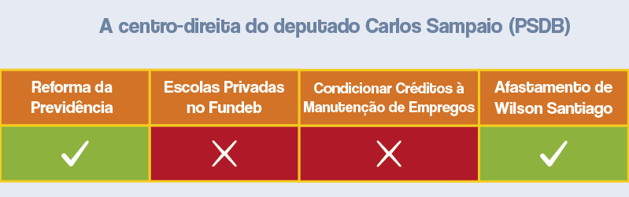

```{r setup, include=FALSE}
library(tidyverse)

load('camara.Rdata')

source('../theme.R')

knitr::opts_chunk$set(echo = FALSE)
knitr::opts_chunk$set(message = FALSE)
knitr::opts_chunk$set(warning = FALSE)

pn = function(x) format(round(x, 2), big.mark = '.', decimal.mark = ',', nsmall = 0, digits = 2)
```

Entender a Câmara dos Deputados não é uma tarefa fácil. 513 deputados se
dividem em 24 [partidos](https://pindograma.com.br/section/partidos.html)
diferentes, que por sua vez têm facções internas e divergências. Para entender
melhor como se comportam os deputados federais na hora de votar, o _Pindograma_
analisou os posicionamentos dos parlamentares em **quatro votações**
importantes.

Muitas análises do Congresso se baseiam em _todas as votações_ de cada deputado
para gerar grandes grupos de comportamento similar entre eles. No entanto, a
maioria das votações no plenário são formalidades e não evidenciam as divisões
reais no pensamento dos parlamentares. Por isso, analisar quatro votações
importantes com atenção nos permite encontrar **alguns grupos que votam juntos
nas propostas mais relevantes** para a sociedade.

As votações analisadas foram:

* A reforma da previdência que, entre outras coisas, aumentou a idade mínima e
  o tempo mínimo de contribuição da aposentadoria.
* Uma medida que permitiria o repasse de recursos do Fundo de Manutenção e
  Desenvolvimento da Educação Básica (Fundeb) -- atualmente destinado apenas à
  educação pública -- para escolas privadas sem fins lucrativos. 
* Uma medida que obrigaria empresas a manterem empregados durante a pandemia
  caso quisessem receber créditos do governo. 
* Uma votação na qual a Câmara decidiu proteger o mandato do deputado Wilson
  Santiago ([PTB](https://pindograma.com.br/2021/01/18/avanteptb.html)-PB),
  afastado do cargo pelo Ministro do STF Celso de Mello, mesmo após [denúncias
  robustas](https://g1.globo.com/politica/noticia/2019/12/21/pgr-denuncia-deputado-wilson-santiago-por-organizacao-criminosa-e-corrupcao-passiva.ghtml)
  de corrupção.

Caso um deputado tenha se abstido em apenas uma dessas quatro votações,
assumimos que ele teria votado junto com a maioria de seu partido na votação
em que ele não esteve presente. Caso ele tenha se abstido em mais de uma
votação, não o incluímos na análise. Dessa forma, deixamos de classificar
apenas 46 deputados.

Com base nesse levantamento, chegamos a cinco categorizações ideológicas — a
nova direita, a centro-direita, o centro, a esquerda tradicional e a esquerda
independente. Além deles, há o "centrão" — grupo com grande diversidade interna
que não é muito bem capturada por essas quatro votações.

---

##### A nova direita, representada por Carla Zambelli ([PSL](https://pindograma.com.br/2020/10/29/psl.html))


Esse grupo tem 79 deputados, e agrupa boa parte dos apoiadores mais ideológicos
do presidente Bolsonaro. Os partidos mais comuns desse grupo são o PSL e o
[NOVO](https://pindograma.com.br/2020/11/10/novo-patri.html), que geralmente se
mostram a favor de diminuir a intervenção estatal na economia e também assumem
um discurso de intolerância à corrupção. 

Políticos relevantes da tropa de choque bolsonarista no Congresso, como as
deputadas Bia Kicis (PSL-DF) e Carla Zambelli (PSL-SP), se encontram dentro
desta categoria. Essas deputadas e seus colegas atuam de maneira similar ao
presidente, reforçando, por exemplo, a pauta de costumes conservadores e a
flexibilização da legislação de armas.

O destaque que permitia repasses do Fundeb a escolas privadas foi de autoria
do Partido Novo. Seus 8 deputados federais todos votaram de acordo com a medida
e, mesmo com números partidários pequenos, influenciaram outros deputados de
partidos como Patriota, PSD e PSDB. Outro projeto na área da educação caro ao
grupo é o projeto que protege pais praticantes do ensino domiciliar
(_homeschooling_) com suas crianças, que deve ser votado logo por ser
[prioridade](https://veja.abril.com.br/educacao/bandeira-bolsonarista-o-ensino-em-casa-entra-em-discussao-no-congresso/)
do governo.

Paralelamente, o grupo também votou a favor da reforma da previdência e contra
a estabilidade de emprego como requisito para que empresas recebessem créditos
durante a pandemia. Tais posicionamentos demonstram, novamente, uma posição
contrária à intervenção do Estado na economia.

Outro episódio emblemático para essa categoria foi a
[votação](https://www.youtube.com/watch?v=65DiE3CMjkg) a favor do afastamento
de Wilson Santiago. Naquele momento, o deputado Gilson Marques (NOVO) se
posicionou dizendo "o deputado está se utilizando do cargo, se utilizando do
mandato de deputado federal para a prática de ações ilícitas, esse é o
principal motivo pelo afastamento".

Há também nesse grupo um membro desse grupo que encapsula a falta de coesão dos
partidos brasileiros: a deputada Liziane Bayer
([PSB](https://pindograma.com.br/2020/11/23/psb.html)-RS). Mesmo sendo parte do
Partido Socialista Brasileiro, Bayer
[defende](https://twitter.com/lizianebayer/status/1351919097433501697)
Bolsonaro e
[declarou](https://www.socialismocriativo.com.br/psb-rs-exige-punicao-a-deputada-que-declarou-apoio-a-arthur-lira/)
voto em Arthur Lira para a presidência da Câmara, contrariando a decisão
nacional de seu partido.

A "nova direita" também inclui o deputado Kim Kataguiri (DEM-SP), que embora
venha criticando Bolsonaro nos últimos meses, tende a votar de acordo com o
grupo do presidente na Câmara.

```{r}
plot_zambelli <- bydeputy %>% filter(grupo == "zambelli") %>% count(siglaPartido) %>% 
  ggplot(aes(reorder(siglaPartido, n), n)) +
  geom_col(
    aes(alpha = reorder(siglaPartido, n) %>% rank(ties.method = "first")%%2 %>% factor()),
    fill = pg_orange
    )+
  geom_text(
    aes(label = n),
    hjust = 2,
    family = "Fantasque",
    size = 5,
    )+
  scale_alpha_manual(values = c(1, .6), guide = F)+ 
  labs(title = "Deputados na \"nova direita\" por partido", caption = "Fonte: Câmara dos Deputados")+
  coord_flip() +
  theme_pindograma()+
  theme(axis.title.y = element_blank(),
        axis.title.x = element_blank(),
        axis.text.x = element_blank(),
        axis.ticks.x = element_blank())

plot_zambelli
```

##### A centro-direita, representada por Carlos Sampaio ([PSDB](https://pindograma.com.br/2020/11/02/psdb.html))



Com 46 deputados, este é o menor grupo de direita e tem Carlos Sampaio
(PSDB-SP) como um de seus proponentes mais relevantes. 

Essa categoria inclui, principalmente, políticos de partidos de direita
independentes do governo, como o PSDB, mas que frequentemente votam com os
governistas.

Diferentemente da "tropa de choque" do bolsonarismo e do Partido Novo, a
centro-direita votou contra o direcionamento do Fundeb para escolas privadas, e
preferiu garantir mais dinheiro para a educação pública.

No entanto, esse grupo votou junto com a "nova direita" na reforma da
Previdência, no não-condicionamento de créditos do governo à manutenção do
emprego e no afastamento do deputado Wilson Santiago.

```{r}
plot_sampaio <- bydeputy %>% filter(grupo == "sampaio") %>% count(siglaPartido) %>% 
  ggplot(aes(reorder(siglaPartido, n), n)) +
  geom_col(
    aes(alpha = reorder(siglaPartido, n) %>% rank(ties.method = "first")%%2 %>% factor()),
    fill = pg_blue
    )+
  geom_text(
    aes(label = n),
    hjust = 2,
    family = "Fantasque",
    size = 5,
    )+
  scale_alpha_manual(values = c(1, .6), guide = F)+ 
  labs(title = "Deputados na \"centro-direita\" por partido", caption = "Fonte: Câmara dos Deputados")+
  coord_flip() +
  theme_pindograma()+
  theme(axis.title.y = element_blank(),
        axis.title.x = element_blank(),
        axis.text.x = element_blank(),
        axis.ticks.x = element_blank())

plot_sampaio
```

##### A esquerda tradicional, representada por Gleisi Hoffmann ([PT](https://pindograma.com.br/2020/10/27/pt.html))


Gleisi Hoffmann (PT-PR), atual presidente do PT, e outros 76 deputados compõem
o maior grupo de esquerda na Câmara. 

Após a apresentação do projeto da reforma da previdência, Gleisi escreveu em
[artigo](https://gauchazh.clicrbs.com.br/opiniao/noticia/2019/03/gleisi-hoffmann-a-proposta-de-reforma-da-previdencia-de-bolsonaro-e-contra-o-povo-cjszzcycy01ep01qk1hw5rlq0.html)
de opinião para a Zero Hora que a "proposta é claramente contra o povo e contra
os trabalhadores". Escreveu que "ao invés de atacar os privilégios como é
preciso fazer, as mudanças vão ampliar a injustiça social em nosso país". Essa
foi uma visão compartilhada por outros partidos de esquerda, como o
[PDT](https://pindograma.com.br/2020/11/14/pdt.html) e alguns membros do PSB. 

Sobre o destaque que permitiria repasses do Fundeb a escolas privadas, o
deputado Pompeo de Mattos (PDT-RS), que também compõe a esquerda tradicional,
afirmou que os proponentes da medida estavam "esquartejando o Fundeb, e cada um
está levando um pedaço para casa – filantrópica, Sistema S – todos setores
empresariais. O dinheiro do Fundeb é dinheiro público, dinheiro federal”.

Reafirmando a narrativa de defesa dos mais vulneráveis, o PT buscou re-incluir
a estabilidade de emprego como um requerimento para receber créditos durante a
pandemia. Na [ocasião](https://www.youtube.com/watch?v=ey5TDT8wfNo), a deputada
Gleisi protestou: "Não é justo que a gente faça uma emenda constitucional que
beneficie empresas financeiras e bancos e os trabalhadores saiam perdendo, que
não haja como contrapartida a manutenção de emprego".

Esse grupo também foi favorável à operação que salvou o mandato do deputado
Wilson Santiago — embora nenhum membro desse grupo tenha explicado o seu voto.
Em outras ocasiões, membros do PT criticaram os excessos e ilegalidades de
investigações de corrupção. 

Curiosamente, o deputado Tiririca, do [Partido
Liberal](https://pindograma.com.br/2020/12/08/plpp.html), vota de acordo com a
esquerda tradicional. No entanto, Tiririca nunca apareceu junto a um candidato
presidencial de esquerda em um palanque. A legenda do deputado faz parte da
sustentação oficial do governo Bolsonaro e tem muitos deputados que votam de
acordo com a categorização direita tradicional.

```{r}
plot_gleisi <- bydeputy %>% filter(grupo == "gleisi") %>% count(siglaPartido) %>% 
  ggplot(aes(reorder(siglaPartido, n), n)) +
  geom_col(
    aes(alpha = reorder(siglaPartido, n) %>% rank(ties.method = "first")%%2 %>% factor()),
    fill = "Red"
    )+
  geom_text(
    aes(label = n),
    hjust = 2,
    family = "Fantasque",
    size = 5,
    )+
  scale_alpha_manual(values = c(1, .6), guide = F)+ 
  labs(title = "Deputados na \"esquerda tradicional\" por partido", caption = "Fonte: Câmara dos Deputados")+
  coord_flip() +
  theme_pindograma()+
  theme(axis.title.y = element_blank(),
        axis.title.x = element_blank(),
        axis.text.x = element_blank(),
        axis.ticks.x = element_blank())

plot_gleisi
```

##### A esquerda independente, representada por Marcelo Freixo ([PSOL](https://pindograma.com.br/2020/11/06/psol.html))


Esse grupo tem 42 deputados, sendo o segundo maior da esquerda. A esquerda
independente conta com o deputado Marcelo Freixo (PSOL-RJ) e com alguns membros
de outros partidos, como o PSB e o PT. 

Esse grupo agrega principalmente uma das alas do PSB e membros do PSOL, partido
fundado por políticos dissidentes do PT durante o escândalo do mensalão.
Políticos de partidos como o PDT e o PT se concentram mais no grupo da esquerda
tradicional.

O grupo de Freixo votou junto com o de Gleisi nas 3 primeiras votações, mas
foi favorável ao afastamento de Santiago por corrupção. Na ocasião, Fernanda
Melchionna (PSOL-RS), que também vota com esse grupo, declarou que a decisão
era "sobre se o deputado deve responder e se defender no processo afastado do
cargo ou se deve seguir no exercício de seu mandato", e optou pelo segundo, já
que, para a deputada, os crimes foram cometidos pelo uso do mandato
parlamentar. 

O grupo inclui três deputados que viriam a se eleger prefeitos de capitais em
2020: João Henrique Caldas (PSB-AL), Edmilson Rodrigues (PSOL-PA) e Eduardo
Braide (PODE-MA). Curiosamente, o último representa o grupo de oposição ao
governador Flávio Dino no Maranhão, e teve apoio tácito de Bolsonaro na eleição
para a prefeitura de São Luís.

```{r}
plot_freixo <- bydeputy %>% filter(grupo == "freixo") %>% count(siglaPartido) %>% 
  ggplot(aes(reorder(siglaPartido, n), n)) +
  geom_col(
    aes(alpha = reorder(siglaPartido, n) %>% rank(ties.method = "first")%%2 %>% factor()),
    fill = pg_yellow
    )+
  geom_text(
    aes(label = n),
    hjust = 2,
    family = "Fantasque",
    size = 5,
    )+
  scale_alpha_manual(values = c(1, .6), guide = F)+ 
  labs(title = "Deputados na esquerda independente por partido", caption = "Fonte: Câmara dos Deputados")+
  coord_flip() +
  theme_pindograma()+
  theme(axis.title.y = element_blank(),
        axis.title.x = element_blank(),
        axis.text.x = element_blank(),
        axis.ticks.x = element_blank())

plot_freixo
```

##### O centro, representado por Tabata Amaral (PDT)


Tabata Amaral (PDT-SP) e outros 17 deputados compõem o menor grupo da Câmara. O
grupo de centro é constituída principalmente por deputados do
[Cidadania](https://pindograma.com.br/2021/02/05/cidsd.html), do PDT e de uma
ala do PSB, que têm fortes ligações com grupos suprapartidários como o
Movimento [Acredito](https://pindograma.com.br/2020/10/02/jovens.html).

Eles votaram junto com a "esquerda independente" em todas as votações, exceto
quanto à reforma da previdência. A votação de Tabata em particular teve grandes
repercussões, já que seu voto foi contrário à orientação da bancada do PDT.
Após aquele episódio, ela começou a ser duramente criticada por políticos dos
outros grupos de esquerda e também por eleitores em redes sociais.

Na época, a deputada paulista justificou que seu voto "garantiu a manutenção
dos benefícios para deficientes e idosos pobres que recebem o BPC", além de
"regras mais brandas para a aposentadoria dos professores". 

Quanto ao afastamento do deputado Wilson Santiago por corrupção, Arnaldo Jardim
(Cidadania), que também está no grupo do centro,
[declarou](https://www.youtube.com/watch?v=65DiE3CMjkg) que "não estamos
abrindo mão de nossas prerrogativas [como deputados], e entendemos que [o
afastamento] tem base constitucional".

Um personagem inesperado que votou como os outros deputados do centro foi
Alexandre Frota (PSDB-SP), que foi eleito pelo PSL na onda do bolsonarismo. Em
2019, Frota rompeu com o clã Bolsonaro e passou a criticar seus apoiadores,
após um histórico de ativismo de direita.

```{r}
plot_tabata <- bydeputy %>% filter(grupo == "tabata") %>% count(siglaPartido) %>% 
  ggplot(aes(reorder(siglaPartido, n), n)) +
  geom_col(
    aes(alpha = reorder(siglaPartido, n) %>% rank(ties.method = "first")%%2 %>% factor()),
    fill = "#B877F0"
    )+
  geom_text(
    aes(label = n),
    hjust = 2,
    family = "Fantasque",
    size = 5,
    )+
  scale_alpha_manual(values = c(1, .6), guide = F)+ 
  labs(title = "Deputados no centro por partido", caption = "Fonte: Câmara dos Deputados")+
  coord_flip() +
  theme_pindograma()+
  theme(axis.title.y = element_blank(),
        axis.title.x = element_blank(),
        axis.text.x = element_blank(),
        axis.ticks.x = element_blank())

plot_tabata
```

##### O "Centrão"

O "Centrão" é o maior grupo da Câmara, com 207 deputados. Ele inclui os deputados
que não se encaixam em nenhum dos grupos anteriores. São parlamentares
oriundos, em sua maioria, de partidos como o PP, o PL e o Republicanos — que
compõem a base do apoio do governo Bolsonaro na Câmara — e de outros como o MDB
e o PSD, que preferem negociar sua adesão ao governo caso a caso. O grupo
também inclui políticos como Aécio Neves (PSDB-MG) e Baleia Rossi (PSDB-SP).

Em geral, o Centrão está disposto a trabalhar de acordo com os interesses do
governo. 96% do grupo votou a favor da reforma da previdência.

O grupo também dá bastante importância aos interesses do empresariado. Um
deputado do "Centrão", Hugo Motta
([Republicanos](https://pindograma.com.br/2020/11/03/dem-rep.html)-PB), foi
relator da PEC do Orçamento de Guerra e decidiu **retirar** o artigo 4º da PEC,
que obrigava empresas que recebessem créditos a manter seus funcionários. Na
[ocasião](https://www.youtube.com/watch?v=ey5TDT8wfNo), Motta defendeu que "ao
criar um entrave, ao trazermos mais uma resistência para que as micro e
pequenas empresas sejam ajudadas, nós não estaremos fazendo bem ao país". 95%
do grupo concordou com a ideia.

Quase todos os políticos do "Centrão" decidiram manter o deputado Wilson
Santiago no cargo, votando contra seu afastamento. O advogado do deputado
[declarou](https://www.youtube.com/watch?v=65DiE3CMjkg) em frente aos deputados
no plenário da Câmara que se Santiago fosse afastado, "isso poderia acontecer
com qualquer um, com um delegado, uma delação premiada, um juiz de primeira
instância pede a suspensão do mandato".

O "Centrão" se dividiu, contudo, na votação para direcionar recursos do Fundeb
a escolas privadas. A maioria dos membros do PL e do Republicanos e do votou
para permitir repasses às escolas privadas. É uma medida que tinha o apoio do
governo Bolsonaro. Já o MDB, o PP e o PSD não priorizaram as preferências do
governo e privilegiaram as reivindicações da deputada Professora Dorinha
(DEM-TO), que defendia que o fundo fosse destinado exclusivamente à educação
pública.

Alguns dos membros desse grupo **são considerados parte do "baixo-clero"** do
Congresso — isto é, são deputados com menos expressão e visibilidade e que
votam com interesses particulares. 

Poucos deputados do baixo-clero chegam a ter relevância nacional, e quando têm,
nem sempre é pela atuação política. A deputada Flordelis (PSD-RJ), cantora
gospel e pastora, é a parlamentar mais conhecida nessa categorização, graças às
acusações de assassinato de seu cônjuge. À exceção do presidente Bolsonaro, que
ascendeu do baixo-clero à Presidência da República, são raros os casos de
políticos dessa categoria que ficam conhecidos pelas conquistas enquanto
parlamentares.

Outros deputados notáveis do grupo são Celso Russomanno (Republicanos-SP),
o atual ministro das Comunicações Fábio Faria (PSD-RN) e o líder do governo
na Câmara Ricardo Barros (PP-PR).

```{r}
plot_flordelis <- bydeputy %>% filter(grupo == "flordelis" | grupo == 'outros') %>% count(siglaPartido) %>% 
  ggplot(aes(reorder(siglaPartido, n), n)) +
  geom_col(
    aes(alpha = reorder(siglaPartido, n) %>% rank(ties.method = "first")%%2 %>% factor()),
    fill = pg_green
    )+
  geom_text(
    aes(label = n),
    hjust = 2,
    family = "Fantasque",
    size = 5,
    )+
  scale_alpha_manual(values = c(1, .6), guide = F)+ 
  labs(title = "Deputados do \"Centrão\" por partido", caption = "Fonte: Câmara dos Deputados")+
  coord_flip() +
  theme_pindograma()+
  theme(axis.title.y = element_blank(),
        axis.title.x = element_blank(),
        axis.text.x = element_blank(),
        axis.ticks.x = element_blank())

plot_flordelis
```

---

#### As votações em mais detalhe

##### A reforma da previdência

A reforma da previdência, Proposta de Emenda à Constituição (PEC) 6/2019, foi
uma das pautas com maior cobertura midiática dessa legislatura até agora. O
voto principal do texto-base na Câmara foi o mais contencioso, aprovado por 379
votos a 131. A maioria necessária para uma PEC é de 308 votos. 

Ao todo, apenas 3 membros não votaram ou se abstiveram. Com a
[reforma](https://g1.globo.com/economia/noticia/2019/11/12/saiba-o-que-muda-com-a-reforma-da-previdencia.ghtml),
a idade mínima de aposentadoria e o tempo mínimo de contribuição foram
elevados, além de mudanças nas regras de transição e nos valores dos pagamentos
da previdência. Alguns deputados na categoria do centro votaram na reforma após
negociações de destaques da proposta, mesmo contra a orientação de seus
partidos. 

```{r}
prev_yes <- byparty %>% filter(votacao == "previdencia") %>%
  pivot_longer(cols = c("Sim", "Não")) %>% 
  filter(name == "Sim", siglaPartido != "PHS") %>% 
  ggplot(aes(reorder(siglaPartido, value), value)) +
  geom_col(
    aes(alpha = reorder(siglaPartido, value) %>% rank(ties.method = "first")%%2 %>% factor()),
    fill = pg_green
    )+
  scale_alpha_manual(values = c(1, .6), guide = F)+ 
  scale_y_continuous(breaks = c(0, 25, 50))+
  labs(title = "Votos a favor")+
  coord_flip(ylim = c(0,53)) +
  theme_pindograma()+
  theme(axis.title.y = element_blank(),
        axis.title.x = element_blank())

prev_no <- byparty %>% filter(votacao == "previdencia") %>%
  pivot_longer(cols = c("Sim", "Não")) %>% 
  filter(name == "Não", siglaPartido != "PHS") %>% 
  ggplot(aes(reorder(siglaPartido, value), value)) +
  geom_col(
    aes(alpha = reorder(siglaPartido, value) %>% rank(ties.method = "first")%%2 %>% factor()),
    fill = pg_orange
    )+
  scale_alpha_manual(values = c(1, .6), guide = F)+ 
  scale_y_continuous(breaks = c(0, 25, 50))+
  labs(title = "Votos contra")+
  coord_flip(ylim = c(0,53)) +
  theme_pindograma()+
  theme(axis.title.y = element_blank(),
        axis.title.x = element_blank())

plot_prev <- cowplot::plot_grid(prev_yes, prev_no) +
  labs(title = "Reforma da Previdência",
       caption = "Fonte: Câmara dos Deputados") +
    theme_pindograma_map()

plot_prev
```

##### A rejeição de recursos do Fundeb para escolas privadas

A votação do novo Fundeb ([PL
4372/2020](https://www.camara.leg.br/proposicoesWeb/fichadetramitacao?idProposicao=2261121))
procurava renovar o principal mecanismo de repasse de recursos do governo
federal para a educação básica. A grande polêmica na votação foi um
[destaque](https://www.camara.leg.br/noticias/717307-camara-rejeita-reinclusao-de-recursos-do-fundeb-para-o-setor-privado/)
apresentado pelo Partido Novo, que permitia o repasse de recursos do fundo para
escolas privadas sem fins lucrativos, como muitas escolas filantrópicas ou
ligadas a igrejas. 

286 deputados votaram contra os repasses para escolas privadas, vencendo os 163
que votaram a favor da medida. 64 não votaram ou se abstiveram.

Para os deputados que votaram contra os repasses para escolas privadas, a
prioridade do Fundeb deveria ser melhorar o ensino público. 

```{r}
fundeb_no <- byparty %>% filter(votacao == "fundeb") %>%
  pivot_longer(cols = c("Sim", "Não")) %>% 
  filter(name == "Sim", siglaPartido != "PHS") %>% 
  ggplot(aes(reorder(siglaPartido, value), value)) +
  geom_col(
    aes(alpha = reorder(siglaPartido, value) %>% rank(ties.method = "first")%%2 %>% factor()),
    fill = pg_orange
    )+
  scale_alpha_manual(values = c(1, .6), guide = F)+ 
  scale_y_continuous(breaks = c(0, 25, 50))+
  labs(title = "Votos contra")+
  coord_flip(ylim = c(0,53)) +
  theme_pindograma()+
  theme(axis.title.y = element_blank(),
        axis.title.x = element_blank())

fundeb_yes <- byparty %>% filter(votacao == "fundeb") %>%
  pivot_longer(cols = c("Sim", "Não")) %>% 
  filter(name == "Não", siglaPartido != "PHS") %>% 
  ggplot(aes(reorder(siglaPartido, value), value)) +
  geom_col(
    aes(alpha = reorder(siglaPartido, value) %>% rank(ties.method = "first")%%2 %>% factor()),
    fill = pg_green
    )+
  scale_alpha_manual(values = c(1, .6), guide = F)+ 
  scale_y_continuous(breaks = c(0, 25, 50))+
  labs(title = "Votos a favor")+
  coord_flip(ylim = c(0,53)) +
  theme_pindograma()+
  theme(axis.title.y = element_blank(),
        axis.title.x = element_blank())

plot_fundeb <- cowplot::plot_grid(fundeb_yes, fundeb_no) +
  labs(title = "Escolas privadas no FUNDEB",
       caption = "Fonte: Câmara dos Deputados") +
  theme_pindograma_map()

plot_fundeb
```

##### A manutenção de empregos pelo Orçamento de Guerra

A [PEC
10/2020](https://www.camara.leg.br/noticias/658923-camara-aprova-em-1o-turno-novo-texto-da-pec-do-orcamento-de-guerra/),
conhecida como o ‘Orçamento de Guerra’, permitiu gastos adicionais para o
combate contra a pandemia. Durante a votação, o PT apresentou um destaque que
condicionava créditos  recebidos por empresas à obrigação de manter empregos.   

Os deputados contrários à proposta
[argumentavam](https://www.youtube.com/watch?v=ey5TDT8wfNo) que ela
prejudicaria a recuperação econômica e complicaria o auxílio às empresas. Já
para os deputados favoráveis, a proposta era uma ferramenta importante para
frear o desemprego.

Porém, a ideia foi rejeitada por 329 votos contrários contra 146 favoráveis.
Apenas 38 não votaram ou se abstiveram. 

```{r}
yes_orcamento <- byparty %>% filter(votacao == "orcamento") %>%
  pivot_longer(cols = c("Sim", "Não")) %>% 
  filter(name == "Sim", siglaPartido != "PHS") %>% 
  ggplot(aes(reorder(siglaPartido, value), value)) +
  geom_col(
    aes(alpha = reorder(siglaPartido, value) %>% rank(ties.method = "first")%%2 %>% factor()),
    fill = pg_green
    )+
  scale_alpha_manual(values = c(1, .6), guide = F)+ 
  scale_y_continuous(breaks = c(0, 25, 50))+
  labs(title = "Votos a favor")+
  coord_flip(ylim = c(0,53)) +
  theme_pindograma()+
  theme(axis.title.y = element_blank(),
        axis.title.x = element_blank())

no_orcamento <- byparty %>% filter(votacao == "orcamento") %>%
  pivot_longer(cols = c("Sim", "Não")) %>% 
  filter(name == "Não", siglaPartido != "PHS") %>% 
  ggplot(aes(reorder(siglaPartido, value), value)) +
  geom_col(
    aes(alpha = reorder(siglaPartido, value) %>% rank(ties.method = "first")%%2 %>% factor()),
    fill = pg_orange
    )+
  scale_alpha_manual(values = c(1, .6), guide = F)+ 
  scale_y_continuous(breaks = c(0, 25, 50))+
  labs(title = "Votos contra")+
  coord_flip(ylim = c(0,53)) +
  theme_pindograma()+
  theme(axis.title.y = element_blank(),
        axis.title.x = element_blank())

plot_orcamento <- cowplot::plot_grid(yes_orcamento, no_orcamento) +
  labs(title = "Condicionar crédito à manutenção de empregos",
       caption = "Fonte: Câmara dos Deputados") +
  theme_pindograma_map()

plot_orcamento
```

##### A manutenção do mandato do deputado Wilson Santiago (PTB-PB), afastado por denúncias de corrupção

O ministro do STF Celso de Mello
[determinou](https://g1.globo.com/pb/paraiba/noticia/2020/01/27/ministro-diz-que-wilson-santiago-colocou-mandato-a-servico-de-agenda-criminosa-na-pb.ghtml)
em dezembro de 2019 o afastamento do cargo de quatro servidores públicos por
denúncia da Procuradoria-Geral da República, que os acusou de ter praticado
corrupção 16 vezes, levando ao desvio de recursos de construções no interior da
Paraíba.

Um desses servidores era o deputado federal Wilson Santiago. De [acordo com a
denúncia](https://politica.estadao.com.br/blogs/fausto-macedo/tu-acha-que-resolve-essas-coisas-sem-dar-nada-a-ninguem-diz-wilson-santiago-a-empresario-durante-acerto-de-propinas/),
ele teria recebido R\$1,2 milhões em propinas, e perguntado a um empresário da
construtora Coenco, “Tu acha que resolve essas coisas sem dar nada a ninguém?".

Nesses casos, o
[entendimento](https://www.conjur.com.br/2020-fev-06/camara-derruba-decisao-stf-afastou-deputado-wilson-santiago)
do Supremo é de que o afastamento do deputado pelo Ministro precisa ser
confirmado pela Câmara dos Deputados. 257 deputados teriam de votar para
tirá-lo do cargo. 

Ao final, 233 deputados defenderam o mandato de Wilson Santiago, enquanto 170
votaram pelo seu afastamento. 110 deputados não votaram — e como cada abstenção
ou ausência foi essencial para manter Santiago no cargo, contamos as abstenções
como se fossem um voto a favor do deputado. 

```{r}
no_wilson <- byparty %>% filter(votacao == "wilson") %>%
  pivot_longer(cols = c("Sim", "Não")) %>% 
  filter(name == "Sim", siglaPartido != "PHS") %>% 
  ggplot(aes(reorder(siglaPartido, value), value)) +
  geom_col(
    aes(alpha = reorder(siglaPartido, value) %>% rank(ties.method = "first")%%2 %>% factor()),
    fill = pg_orange
    )+
  scale_alpha_manual(values = c(1, .6), guide = F)+ 
  scale_y_continuous(breaks = c(0, 25, 50))+
  labs(title = "Votos contra")+
  coord_flip(ylim = c(0,53)) +
  theme_pindograma()+
  theme(axis.title.y = element_blank(),
        axis.title.x = element_blank())

yes_wilson <- byparty %>% filter(votacao == "fundeb") %>%
  pivot_longer(cols = c("Sim", "Não")) %>% 
  filter(name == "Não", siglaPartido != "PHS") %>% 
  ggplot(aes(reorder(siglaPartido, value), value)) +
  geom_col(
    aes(alpha = reorder(siglaPartido, value) %>% rank(ties.method = "first")%%2 %>% factor()),
    fill = pg_green
    )+
  scale_alpha_manual(values = c(1, .6), guide = F)+ 
  scale_y_continuous(breaks = c(0, 25, 50))+
  labs(title = "Votos a favor")+
  coord_flip(ylim = c(0,53)) +
  theme_pindograma()+
  theme(axis.title.y = element_blank(),
        axis.title.x = element_blank())

plot_wilson <- cowplot::plot_grid(yes_wilson, no_wilson) +
  labs(title = "Afastamento de Wilson Santiago",
       caption = "Fonte: Câmara dos Deputados") +
  theme_pindograma_map()

plot_wilson
```

---

**Dados utilizados na matéria**: Votações da Câmara dos Deputados (Câmara dos
Deputados).

**Contribuíram com dados**: Antonio Piltcher e Daniel Ferreira.

Para reproduzir os dados e os gráficos da matéria, o código pode ser encontrado [aqui][1].

**Créditos da imagem**: Waldemir Barreto/Agência Senado, Câmara dos Deputados.

[1]: https://github.com/pindograma/materias/blob/master/2021-05-24-camara2/Camara.Rmd
