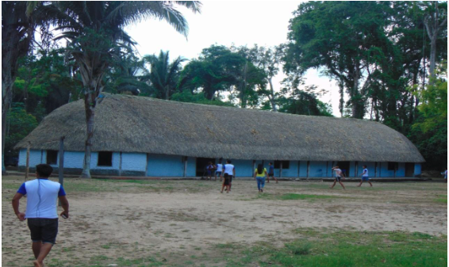
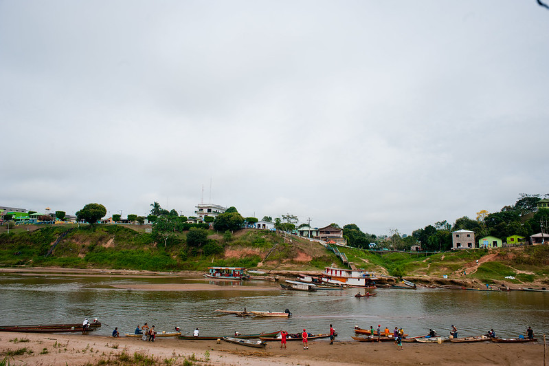
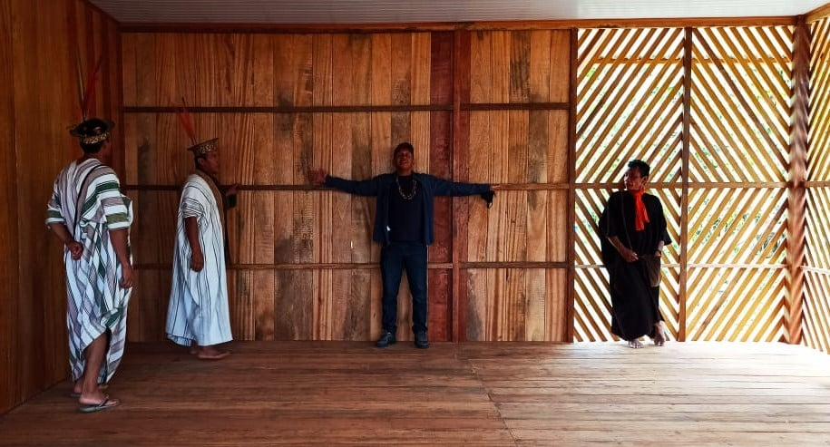

```{r setup, include=FALSE}
library(tidyverse)
library(readxl)

source('../theme.R')

knitr::opts_chunk$set(echo = FALSE)
knitr::opts_chunk$set(message = FALSE)
knitr::opts_chunk$set(warning = FALSE)

pn = function(x) format(round(x, 2), big.mark = '.', decimal.mark = ',', nsmall = 0, digits = 2)
```

As aulas já estão planejadas, os professores já foram contratados, os alunos já
estão matriculados, mas não tem aula. O motivo? Ninguém consegue entregar a
merenda e os materiais escolares. Ou melhor, ninguém se dispõe a ir até a
escola entregar os materiais. 

Esse é um dos desafios enfrentados pela Escola Estadual Indígena de Educação
Básica Zarup Wej, localizada na Terra Indígena Zoró, no município de
Rondolândia (MT), responsável pela administração da escola. Durante a
elaboração do orçamento da cidade para 2020, os Zoró e seus aliados — um dos
quais relatou esta história à reportagem — passaram semanas negociando com os
governos municipal e estadual um aporte de verbas para o transporte de
materiais. O orçamento da cidade previa a compra dos mantimentos com
fornecedores no centro do município, mas a entrega das encomendas na escola
afastada e acessível apenas por precárias estradas de barro encareciam demais a
operação. 

Quando resolveram o problema das entregas, surgiu outra questão: a escola
consumia merenda demais, o que também não cabia no orçamento da cidade. O
motivo da reclamação dos gestores públicos se deve ao fato de a aldeia-escola
Zarup Wej fornecer 5 refeições ao dia para todos seus alunos e funcionários.
Diferentemente de outras escolas, a Zarup Wej opera ininterruptamente durante
15 dias do mês, com seus alunos morando — e também comendo — nas dependências
da instituição por todo o período. Depois desse tempo, passam mais 15 dias com
suas famílias e o ciclo se repete.

Essa idiossincrasia do funcionamento da escola dos Zoró não é modismo da
cidadezinha de 3.500 habitantes, mas uma consequência de um direito conquistado
pelas populações indígenas do Brasil na Constituição de 1988: a educação
escolar indígena.

---

A relação entre os indígenas brasileiros e a educação formal não-indígena tem
uma longa e [tumultuada
história](https://www.scielo.br/scielo.php?script=sci_arttext&pid=S0102-01882010000200004),
passando pela missão civilizatória de missionários cristãos, pelas empreitadas
da primeira metade do século XX que visavam ["integrar o índio à
nação"](https://periodicos.uepa.br/index.php/cocar/article/view/1597) e
finalmente pelas ONGs surgidas nas décadas de 1970 e 1980 (que ainda atuam na
área). Os povos originários tiveram seu direito de participar do processo de
elaboração de políticas públicas para sua própria educação [apenas na
Constituição](http://www.funai.gov.br/index.php/educacao-escolar-indigena?limitstart=0#])
de 1988, depois de anos de luta.

De início, o direito ficou mais na Constituição que na realidade. A década de
1990 foi um período de concretização dessa garantia legal. A consolidação legal
veio apenas em 2001, com o lançamento do [Plano Nacional de
Educação](http://www.planalto.gov.br/ccivil_03/leis/leis_2001/l10172.htm)
daquele ano. O PNE dedicou um capítulo inteiro à educação diferenciada para
indígenas e determinou a criação da categoria "escola indígena". 

As escolas indígenas se diferenciam do restante dos colégios da rede pública
por serem instituições voltadas para a **preservação e transmissão da cultura
tradicional da comunidade que ela atende**. Os currículos são elaborados em
conjunto com cada comunidade para incluir aulas sobre práticas culturais e
saberes tradicionais. Além do português, o ensino pode ser feito no idioma
falado pelo povo, com material didático
[específico](https://agenciabrasil.ebc.com.br/educacao/noticia/2016-04/quase-metade-das-escolas-indigenas-nao-tem-material-didatico-especifico)
para cada língua. Os professores das escolas indígenas são também incentivados
a frequentarem o [magistério
indígena](https://portalamazonia.com/noticias/educacao/curso-de-formacao-de-professores-em-magisterio-indigena-desperta-educadores-a-buscarem-cursos-superiores)
— cursos de nível médio que buscam capacitar professores indígenas a
desenvolver currículos interculturais e maleáveis às necessidades de suas
comunidades.

Desde sua adoção em nível nacional em 2001, houve uma grande expansão das
escolas indígenas. Entre 2000 e 2020, o número de escolas indígenas
praticamente dobrou, de 1.375 para 3.362 registradas no ano passado. 

```{r}
# NOTA: Os dados foram obtidos filtrando a planilha de ESCOLAS dos Censos
# Escolares entre 2000 e 2020 por escolas indígenas. Os dados originais não são
# incluídos aqui por conta de seu tamanho.

escolas_indigenas = tibble(
  year = seq(2000, 2020),
  n = c(1375, 1656, 1725, 2079, 2233, 2327, 2423, 2550, 2700, 2698,
        2890, 2954, 2957, 3061, 3136, 3085, 3212, 3307, 3357, 3380, 3362)
)

ggplot(escolas_indigenas, aes(x = factor(str_sub(year, 3, 4)), y = n, group = 1)) +
  labs(title = 'Escolas indígenas no Brasil', caption = 'Fonte: Censo Escolar/Inep, compilado pelo Pindograma') +
  geom_line(size = 2, color = pg_blue) +
  geom_point(size = 4, color = pg_orange) +
  xlab('Ano') + ylab('') +
  theme_pindograma() +
  theme(axis.title.x = element_text(margin = margin(t=0)))
```

Juntando alunos de ensino infantil, fundamental, médio e turmas de educação de
jovens e adultos, a quantidade de alunos nestas escolas já soma [mais de 255
mil][2]. É um crescimento de 50% desde 2005, quando havia apenas [164 mil
matrículas][3]. Não é possível dizer ao certo o alcance das escolas em
comparação à população indígena, já que as informações demográficas no país
estão desatualizadas
[desde](https://agenciabrasil.ebc.com.br/economia/noticia/2015-03/ibge-cancela-contagem-populacional-por-falta-de-recursos)
[2010](https://agenciabrasil.ebc.com.br/economia/noticia/2021-04/ibge-suspende-provas-para-recenseadores-do-censo-2021).

Cruzando as informações do último Censo Demográfico com os números de
matrículas das escolas indígenas, constatamos que quanto maior um povo, mais
escolas indígenas existem para ele, sugerindo uma cobertura adequada do ensino
específico para a população. De acordo com o Censo Escolar de 2020, há escolas
dando aulas em 178 línguas nativas diferentes.

```{r}
alunos <- read_delim("alunos_por_lingua.csv", ";", escape_double = FALSE, trim_ws = TRUE)
pop  <- read_excel("pop_ind_c2010.xlsx") %>%
  mutate(tot_pop = as.numeric(tot_pop))
fala <-  read_excel("fal_ind_c2010.xlsx")

alunos_dados <- alunos %>%
  merge(pop, by = "ling_etn", all.x = T) %>% 
  merge(fala, by = c("tron", "fam"), all.x=T)

ggplot(alunos_dados, aes(x = tot_pop, y = somente_ensino)) +
  labs(title = 'Matrículas e População de Grupos Indígenas', subtitle = '(cada ponto é um grupo indígena)',
       caption = 'Fonte: Censo Demográfico 2010/IBGE; Censo Escolar/Inep.\nCompilados pelo Pindograma.') +
  geom_point(color = pg_blue) +
  geom_smooth(color = pg_orange, method = 'lm') +
  xlab('População (2010)') +
  ylab('Matrículas (2020)') +
  theme_pindograma()
```

--------

Esses dados, no entanto, maquiam a realidade da educação indígena no
Brasil, marcada por diversas dificuldades que os dados não capturam muito bem.
Em entrevista ao _Pindograma_, o ativista e educador Mauro de Souza relatou
algumas das dificuldades que ele já testemunhou em quase 20 anos de trabalho
com comunidades indígenas no Norte do país.

Mineiro, Mauro se descreve como um preto brasileiro de baixa renda. Se formou
como historiador na Universidade Federal de Ouro Preto e se envolveu com a
educação de professores indígenas depois de se desiludir com a distância  entre
a academia e o povo sobre o qual ela produzia conhecimento.

Depois de um tempo trabalhando com algumas comunidades Guarani-Mbyá no Rio de
Janeiro, Mauro foi para Rondônia, onde passou a integrar um projeto de
escolarização de agentes de saúde indígenas. “Foi aí então que eu tive o
primeiro contato com as deficiências reais que tangem a educação escolar
indígena”, conta.

A maioria dos alunos do curso eram escolhidos pelas suas comunidades para fazer
o curso apenas por terem passado algum tempo numa escola. Muitas vezes não
tinham nenhum preparo prévio para trabalharem com a saúde, embora soubessem ler
e escrever.

Depois dessa experiência inicial, Mauro continuou na região Norte, trabalhando
com diversos povos do Acre, de Rondônia e do norte do Mato Grosso. Entre eles
estão os Zoró de Rondolândia. Mauro passou um tempo trabalhando na escola Zarup
Wej e também auxiliou nas negociações do orçamento da escola. Ao longo de sua
entrevista ao _Pindograma_, Mauro fez questão de pontuar os problemas sérios
que o atual modelo de educação escolar indígena traz, não só para os Zoró, mas
para diversos povos.



O primeiro deles é a dificuldade do contato intercultural. Para muitas
comunidades da região, o contato com a sociedade não-indígena [é
recente](https://pdfs.semanticscholar.org/d904/22bbda3b228e6b4b8f983f44db911c5fc2d7.pdf),
de apenas 40 ou 50 anos. Diferente de povos com um longo histórico de contato,
para povos ainda relativamente isolados, a introdução da escola causa
estranhamentos. Tanto agentes do governo quanto lideranças da própria
comunidade costumam se desentender devido às diferenças entre as concepções
culturais de educação indígena e não-indígena. 

Mesmo hoje, com a exigência de diálogo com a comunidade para a elaboração de um
currículo moldado para as especificidades de um povo, muitas vezes um modelo
escolar completamente descolado da realidade do grupo é imposto aos indígenas.
De acordo com Mauro, um dos maiores desafios nos anos iniciais de muitas
escolas é como encaixar a figura do professor na realidade da aldeia. Como a
educação tradicional geralmente acontece de maneira orgânica, por diversos
membros da comunidade compartilhando saberes distintos, a profissão de
professor fica deslocada e passa a carregar outros significados.

Como relata Mauro, o professor “é um novo ícone na aldeia, um novo personagem
que [tem] status, que recebe dinheiro”. Diferente de outras vagas de
professores em escolas públicas, [as vagas de professor em escola
indígena](https://www.sed.sc.gov.br/documentos/material-de-estudo-para-concurso-magisterio-indigena-2017/5653-as-leis-e-a-educacao-escolar-indigena-pcns-2002/file)
podem ser preenchidas tanto por concursos quanto por indicação da comunidade,
através de negociação com as secretarias de educação. Essa flexibilidade existe
para dar mais protagonismo ao povo na contratação dos educadores de sua
preferência, mas ela nem sempre garante a qualidade do ensino. O status e o
salário acabam levando a situações onde o cargo de professor é preenchido por
amigos das lideranças locais ou para dar prestígio a membros da família de um
chefe — e não por considerações pedagógicas.

A estrutura física de muitas escolas também é problemática. Construídas em
geral como escolas convencionais, em várias aldeias o prédio da escola destoa
da arquitetura nativa e se torna um elemento estranho no seio da comunidade.
Mauro compara a presença desses prédios com a construção de igrejas. De acordo
com ele, ambos os prédios são símbolos da colonização e da imposição unilateral
de modelos de organização social não-indígena aos povos originários. O próprio
prédio da escola “acaba se tornando um espaço tal qual a igreja, como se fosse
um monumento perdido ali na aldeia [...] um endereço onde se vai para se ter um
evento e logo que aquilo acaba todo mundo vai embora”. 

Muitos prédios escolares são preteridos por professores, que preferem ministrar
aulas em locais típicos de reuniões comunitárias como tapiris ou caramanchões
ou mesmo ao ar livre. O prédio escolar pode se tornar um local administrativo,
de contato entre o governo e a comunidade, mas raramente atende às demandas
pedagógicas dos indígenas.

Além disso, mesmo pelos parâmetros de escolas públicas comuns, a estrutura
desses prédios tende a ser precária. Segundo dados do Censo Escolar 2020, 69,1%
das escolas indígenas não têm energia elétrica, 37,3% não possuem água potável
e 43,1% não têm banheiros. Além de infraestrutura básica, 78,6% não têm acesso
à internet e 89,4% não possuem uma biblioteca. Dada essa realidade, não
surpreende que em alguns casos os prédios terminam deteriorados e quase
abandonados pela comunidade.

A qualidade do ensino nas escolas indígenas também não é fácil de se medir. O
INEP (Instituto Nacional de Estudos e Pesquisas Educacionais) não inclui essas
escolas no Saeb, série de testes aplicados de dois em dois anos por todo o país
para avaliar o desempenho acadêmico dos alunos brasileiros. Sem uma avaliação
educacional própria, é quase impossível formular políticas públicas baseadas em
evidências para as escolas indígenas. (O INEP não respondeu às tentativas de
contato da reportagem).

Mas, mesmo superando os empecilhos iniciais, as dificuldades não se encerram
quando uma comunidade aceita o modelo da escola indígena proposta pelo governo.
Uma escola de educação diferenciada existir no papel é mais fácil que uma
implementação bem sucedida desse projeto. A elaboração de um currículo
específico requer a cooperação entre secretarias de educação e lideranças
comunitárias.

Os cursos de magistério indígena são um passo para esse diálogo, pois visam
qualificar os professores para mediar a interação entre a educação tradicional
dos povos indígenas e a educação não-indígena. Mas este tipo de formação é
insuficiente quando o curso não consegue lidar com povos e culturas diversas. 

Segundo Mauro, “os cursos principais são cursos dentro das universidades onde
se tem dentro de uma sala de aula uma pluralidade enorme de etnias e línguas
diferentes, culturas diferentes, costumes diferentes que são tratados como
iguais,” explica.

Diante do abandono do Estado, o ônus de garantir o funcionamento recai sobre o
que Mauro chama de "exércitos de uma pessoa só" —  professores, ativistas,
alunos e até eventuais funcionários públicos que, por um motivo ou outro,
decidem se dedicar ao funcionamento de uma escola, mesmo que saia do próprio
bolso.

---

Apesar destes problemas, durante sua trajetória na região, Mauro também
conheceu histórias de povos que conseguiram se organizar e usar a escola
específica como uma ferramenta efetiva na preservação de sua cultura. Um caso
que fez questão de destacar foi o do povo Ashaninka, do vale do Juruá no Acre.
"Acho que eles [são] um bom exemplo disso, de domínio de como colocar a sua
marca nas escolas”, diz. A grande maioria dos Ashaninka vivem no Peru, mas, no
Brasil, o povo também vive em pequenas comunidades distribuídas pelo Acre. A
maior dessas comunidades está localizada na aldeia Apiwtxa, da Terra Indígena
Kampa do Rio Amônia, no município de Marechal Thaumaturgo (AC).

A cidadezinha de Marechal Thaumaturgo fica a mais de 550 km da capital acreana
de Rio Branco e é inacessível por estrada. Mesmo com o isolamento, a história
da educação escolar indígena no município tem quase 30 anos. A Escola Indígena
Samuel Piyãko foi fundada em 1992, no mesmo ano da demarcação da terra dos
Ashaninka na região, e a ideia de criar uma escola para a comunidade surgiu
justamente em meio à luta pela demarcação da terra. 



Antes da demarcação, muitos membros da comunidade eram explorados por
madeireiros e seringueiros que ocupavam as terras ashaninka. Valendo-se das
dificuldades na comunicação com os nativos, os não-indígenas tiravam vantagem
em acordos e contratos, faltavam com pagamentos e mentiam sobre contas e
dívidas. Com o reconhecimento oficial da terra, a preocupação das lideranças
da época passou a ser preparar as futuras gerações para um contato mais
equânime com a sociedade não-indígena. Como conta Wewito Piyãko, atual diretor
da Escola Samuel Piyãko, havia a necessidade de um espaço para “se trabalhar a
educação escolar, principalmente a escrita e a matemática, que era exatamente
pra sair dessa dependência da mão dos patrões, [para deixar] de ser enganado
pelos patrões, [para] fazer os nossos próprios negócios”.

Além de ter o apoio da FUNAI, a vontade dos Ashaninka por uma escola foi
auxiliada pela atuação da Comissão Pró-Índio do Acre, uma organização sem fins
lucrativos fundada em 1979 para apoiar os esforços de comunidades indígenas no
estado. A CPI-Acre já promovia cursos de formação de professores indígenas no
estado desde 1983 e auxiliou a comunidade no processo de criar um projeto de
escola que refletisse os valores e os objetivos da comunidade. Wewito pontua
que a ajuda da ONG foi importante, mas que o fundamental foi “a comunidade já
ter esse preparo de se organizar e de dizer: "Nós vamos botar uma educação
dentro da nossa comunidade, mas já colocar uma posição: [vai ser] uma educação
voltada pra nossa cultura, voltada pra nossa realidade”.

O professor, formado em um dos cursos da CPI-Acre, conta com orgulho de como os
habitantes da aldeia Apiwtxa organizam sua escola. “A gente trabalha na escola
uma parte teórica e uma parte na prática, que é fora de sala de aula", explica.
As atividades fora da sala de aula são desenvolvidas com o restante da
comunidade e com os parentes das próprias crianças.  Os alunos são ensinados a
trabalhar no roçado, na pescaria e na caça, ajudam no preparo de festas e
brincadeiras tradicionais, aprendem sobre a medicina e o artesanato, dentre
outras atividades. Até o quinto ano, todas as aulas são ministradas
exclusivamente em ashaninka, já que a maioria dos alunos não fala português.

Apesar da animação, Wewito também relata dificuldades, dentre as quais o
abandono escolar. “Poucos alunos chegam ao ensino médio, né? Eles desistem,
porque não quer[em] mais estudar, porque aprender a ler e escrever já é o
suficiente. Mas eu acredito que isso é uma cultura né? A gente também não pode
forçar ninguém a fazer uma coisa que não quer”, lamenta. O professor explica
que a escola não dá a formação para os alunos “competirem com o mercado de fora
[da terra indígena]”, mas ela é um passo importante para o preparo de futuras
lideranças e da estruturação da comunidade. 

Além de ser diretor da escola, Wewito também é presidente da [Associação
Ashaninka do Rio Amônia Apiwtxa](https://apiwtxa.org.br/). A Associação
coordena diversos projetos encabeçados pelos Ashaninka tanto dentro de suas
terras quanto na região do Alto Juruá em geral, estabelecendo laços com as
comunidades não-indígenas de Marechal Thaumaturgo e outras cidades. 

Essa relação mais igualitária cultivada ao longo dos anos permitiu que, em
2016, Marechal Thaumaturgo fosse palco de um momento histórico para o estado do
Acre. Naquele ano, Isaac Piyãko, liderança dos Ashaninka, foi eleito o primeiro
prefeito indígena da história do estado. O prefeito também foi reeleito em 2020
com mais de 53% dos votos no primeiro turno.

A gestão de Isaac faz questão de dar apoio aos indígenas da cidade, nem sempre
contemplados adequadamente em gestões anteriores. Wewito conta que desde o
começo da nova gestão, a relação com a prefeitura melhorou. Salários são pagos
em dia, a Escola Samuel Piyãko foi reformada em 2020 e já não falta mais
gasolina para o transporte dos alunos e professores e a entrega da merenda. No
entanto, o professor lamenta que muitos desses avanços foram suspensos frente à
pandemia de COVID-19, que interrompeu os trabalhos da escola e criou novas
dificuldades orçamentárias para o município.



Pedro Lima, coordenador indígena da Secretaria Municipal de Educação,
compartilha das preocupações de Wewito com a pandemia, mas avalia que, em
tempos normais, a educação indígena no município é satisfatória. Para ele,
Marechal Thaumaturgo é um lugar de exceção quando se trata de educação escolar
indígena, uma história de sucesso construída com muita paciência e diálogo.
Segundo ele, o segredo está no ouvir. “Acredito que a eleição de Isaac
[Piyãko], garantiu ainda mais que esse processo chegasse a esse ponto.  [Ele]
fez com que tivéssemos um olhar ainda mais amistoso sobre todos os índios do
nosso município, mas tudo isso é fruto do empenho de todos que em alguma parte
do tempo ontem ou hoje contribuíram para esse processo”.

Do ponto de vista institucional, Lima elogia a CPI-Acre e iniciativas do MEC e
da FUNAI no passado, mas se queixa do apoio minguante dos governos estadual e
federal. “Hoje esses órgãos já não atuam como antes. Agora com esse processo de
pandemia, chegaram algumas boas recomendações vindas da FUNAI, mas sinto falta
de uma comunicação direta, onde possamos pôr nossas posições de realidade
local. Já do governo do estado seria importante um pouco mais de investimentos
em formação acadêmica de professores e formações de encontro com os povos
originários”, diz.

---

O caso dos Ashaninka em Marechal Thaumaturgo demonstra como a implementação
bem-sucedida de um projeto de educação indígena pode significar um avanço para
uma comunidade que busca defender seus direitos e ter uma relação mais
harmônica com seus vizinhos não-indígenas. A educação escolar adequada pode
também ser um caminho ao ensino superior por meio de vestibulares indígenas,
por exemplo, já oferecidos em pelo menos [15 universidades
públicas](https://guiadoestudante.abril.com.br/universidades/inclusao-de-indigenas-nas-universidades-publicas-aumenta/),
como a UnB e a Unicamp.

A melhoria da educação indígena é uma das principais pautas defendidas pela
deputada federal Joênia Wapichana (REDE-RR). Joênia foi a  primeira mulher
indígena eleita ao Congresso Nacional e já destinou mais de R\$ 40 milhões em
emendas parlamentares para a reforma e adequação de mais de 100 escolas
indígenas em seu estado. Em uma [entrevista para a
FUNAI](http://www.funai.gov.br/index.php/comunicacao/noticias/5065-funai-entrevista-joenia-wapixana-a-primeira-mulher-indigena-a-ser-eleita-deputada-federal-no-brasil)
em 2018, a então recém-eleita deputada afirmou que seu mandato seria focado em
“fazer com que os direitos indígenas não sejam só na defesa e sim
propositivos”, defendendo, entre outras medidas, a implementação de um sistema
de educação escolar indígena de qualidade.

Hoje, o professor Mauro mora em Cacoal (RO) e trabalha como conselheiro
administrativo na Coopaiter, uma cooperativa do povo Paiter-Suruí que presta
apoio aos castanheiros da comunidade. Apesar de não estar trabalhando com
nenhuma escola no momento, sempre está em contato com lideranças de povos
amigos. Cético em relação aos rumos da educação indígena diante do atual
governo federal e do desmonte de órgãos como a FUNAI, Mauro parece resignado à
realidade precária à qual o Estado relega os povos originários, sem dados
adequados para avaliar e sem o preparo para lidar com essas dificuldades. Mesmo
assim, não deixa a região por nada. “São necessários esses exércitos de homens
ou de mulheres sós, né”.

---

**Dados utililzados na matéria**: Censo Escolar (Inep/MEC); Censo Demográfico
2010 (IBGE).

Para reproduzir os gráficos desta matéria, o código pode ser consultado [aqui][1].

**Contribuíram com dados** Daniel Ferreira e Antonio Piltcher.

**Créditos da imagem**: Daniela Castro – Assecom/PMMTH.

[1]: https://github.com/pindograma/materias/2021-05-30-indigenas/EscolasIndigenas.Rmd

[2]: http://portal.mec.gov.br/busca-geral/206-noticias/1084311476/75261-mec-trabalha-por-avancos-na-educacao-escolar-indigena

[3]: https://download.inep.gov.br/publicacoes/institucionais/estatisticas_e_indicadores/estatisticas_sobre_educacao_escolar_indigena_no_brasil.pdf
